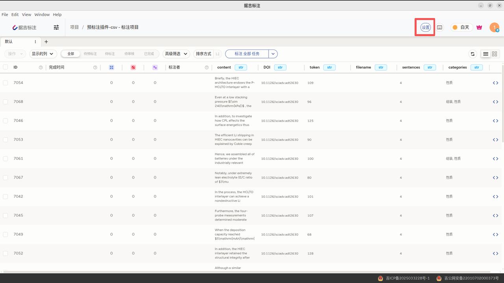
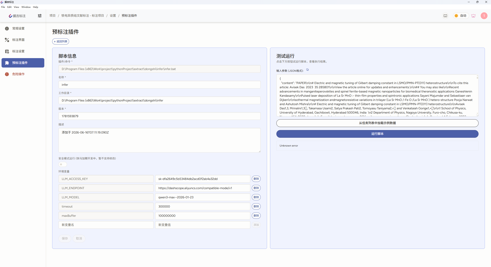
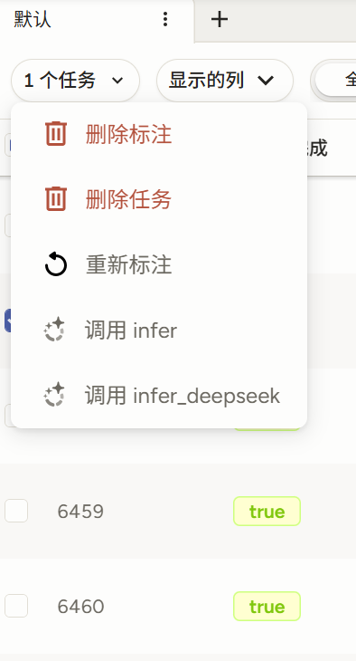
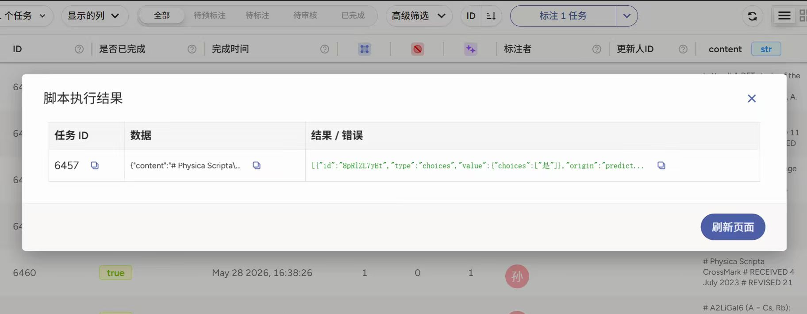
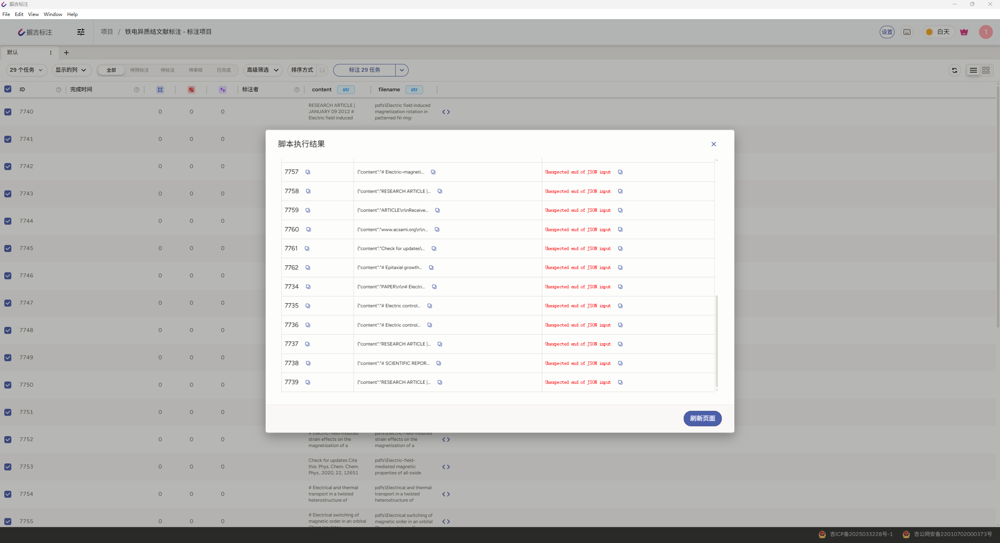

---
# 基础元数据
title: "功能介绍：AI 预标注插件"
linkTitle: "预标注插件"
weight: 130
date: 2026-03-24T21:15:00+08:00

# SEO 管理模块
params:
    seo:
    title: "AI自动标注插件定制 | 据吉网 (Jujidata) 预标注加速工具"
    description: "通过据吉网预标注插件显著提升数据标注效率。支持桌面端工具加载、自定义AI模型集成及在线Playground调试，助力企业实现自动化数据处理。"
    keywords: ["预标注插件", "自动标注AI", "标注加速工具", "据吉网Playground", "智能数据标注"]
    canonical: "https://www.jujidata.com/docs/features/pre-annotation/"
    robots: "index, follow"
---

# 预标注插件的使用
使用预标注插件功能，必须先下载并登录**据吉客户端**，网页版暂不支持该插件能力。本文完整介绍插件上传、启用、使用、管理及常见注意事项。

## 一、前期准备
1. 提前下载并安装据吉客户端，完成账号登录。
2. 准备好本地预标注插件文件，保证文件完整、无损坏。

## 二、进入插件配置入口
1. 登录据吉客户端，进入**数据标注平台**。具体操作见[自标注模式](../concepts/self-annotated/)

2. 在任务列表页面，点击页面上方/右侧的**设置**按钮，进入平台配置面板。

## 三、上传预标注插件
1. 在弹出的侧边配置栏中，找到并选中**预标注插件**分类。

2. 点击页面内 **添加预标注插件** 按钮，唤起本地文件选择窗口。

3. 选中本地存放的插件文件，确认上传，等待系统解析完成。

## 四、插件启用与状态管理

1. 插件上传成功后，列表内会展示已上传的插件名称、版本、状态等信息。

2. 点击插件对应的**开关按钮**，将插件切换为启用状态。

### 插件基础管理
- 停用插件：点击开关即可临时关闭，关闭后标注界面无法调用该插件。
- 删除插件：选中目标插件，点击**删除**按钮，可移除已上传的插件，删除后需重新上传方可使用。
- 重新上传：插件异常时，可直接覆盖上传新版本插件。

## 五、标注任务中调用插件
1. 返回标注平台**任务列表页**，可以在最左侧下拉框查看已有插件信息。

2. 选中需要处理的标注任务，点击进入标注操作界面。在标注界面右下角，找到已启用的插件名称。

3. 点击插件名称，启动预标注功能，系统自动执行批量预标注。

## 六、预标注内容核对与提交
1. 插件完成预标注后，页面会展示自动标注结果。

- 运行成功

- 运行出错

2. 人工逐项核对标注内容，对错误、遗漏的内容进行手动修改、补全。

3. 全部内容确认无误后，点击**提交**按钮，完成单条/批量数据标注。

## 七、补充规则与注意事项
1. 数量限制：平台支持同时上传多个预标注插件，各插件独立启停、互不影响。
2. 权限说明：仅项目管理员、标注权限账号可上传、启用、调用预标注插件；普通查看权限账号无法操作。
3. 数据安全：预标注仅作用于当前标注任务数据，不会篡改原始源文件。
4. 异常处理
   - 插件无法启动：检查开关是否开启，重启客户端后重试；
   - 上传失败：检查插件文件是否损坏、格式是否合规，重新下载插件后上传；
   - 预标注无结果：确认任务数据类型与插件适配，核对插件版本。

