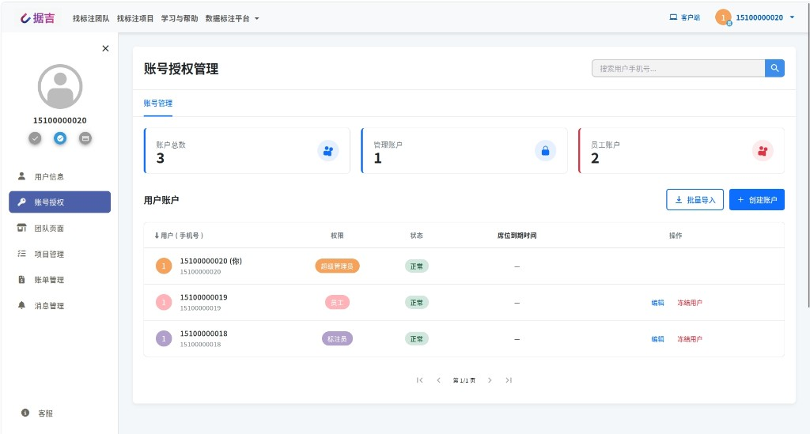
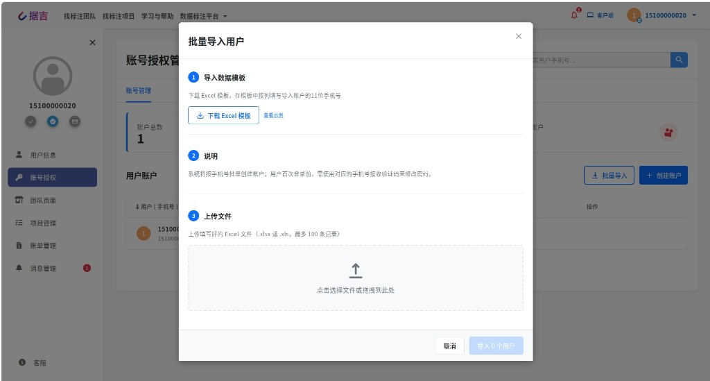
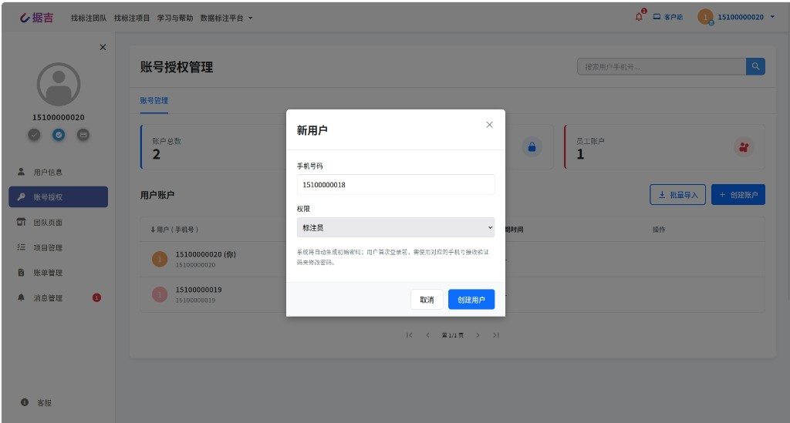

---
# 基础元数据
title: "功能介绍：账号授权管理"
linkTitle: "账号授权管理"
weight: 81
date: 2026-04-30T10:53:00+08:00

# SEO 管理模块
params:
  seo:
    title: "账号授权管理 | 据吉网 (Jujidata)"
    description: "介绍账号授权管理中的账号权限、搜索、邀请、批量导入、创建用户和上传导出相关规则。"
    keywords: ["账号授权管理", "IAM", "用户权限", "批量导入", "创建用户", "据吉网"]
    canonical: "https://www.jujidata.com/docs/concepts/users-iam"
    robots: "index, follow"
---

# 账号授权管理

## 一、功能介绍

- 账号授权管理功能：可修改用户权限、账号状态，并支持席位分配与撤回。

具体账号权限说明请参考：[账号权限说明书 (IAM)](./juji-iam/)。

## 二、搜索与账号管理

### 1) 搜索功能
- 支持按手机号搜索用户。
- 支持模糊查询。

### 2) 账号管理
- 展示账户总数。
- 展示管理账号数量。
- 展示员工账号数量（此处员工指除超级管理员外的所有账号）。

## 三、用户账户

- 可邀请新用户或已有用户加入。
- 被邀请用户会收到消息提示，可选择 `接受` 或 `拒绝` 。
- 企业管理员会收到邀请处理通知。
- 若邀请对象是新用户：首次登录需先点击 `忘记密码` 完成密码设置，再次登录即可使用（自动注册）。

### 1）批量导入

- 下载 Excel 模板后，按要求填写手机号。
- 可点击上传区域选择文件进行上传，也可选择文件拖拽到指定区域上传。
- 批量导入时，所有用户默认权限为 `员工`。

### 2）创建用户

- 通过手机号创建账户
- 一次只能邀请一个用户。
- 创建时可单独设置该用户权限。

<!--
## 四、企业席位

- 上方卡片显示剩余额度、已有席位成员、可分配成员；
- 可给权限不大于自己的企业/团队成员分配席位；
- 支持分配席位、追加席位、撤回席位（可选择席位数量）。
-->
