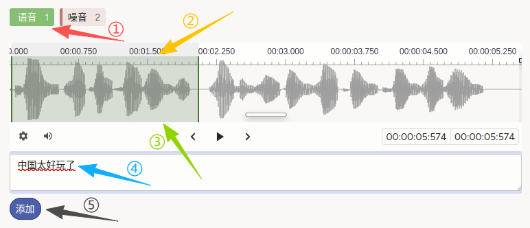
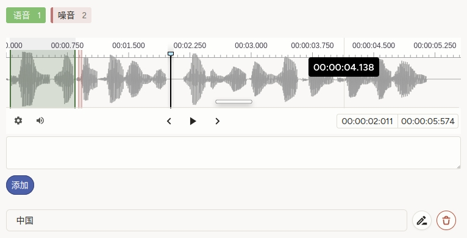

# 使用片段的自动语音识别使用说明

可以理解为「先在时间轴上**切出若干段**，标成语音或噪音，再**对每一段语音分别听写**」。与 [整段转写](./automatic-speech-recognition/) 相比，本模版强调**区段时间边界 + 区段文本**对齐，便于做带噪声间隔的长音频数据集。

## 标注核心作用

1.  `Labels` 提供 **语音 / 噪音** 等类别，在 `Audio` 上创建可着色区段；
2.  `TextArea` 设 `perRegion="true"`，转写内容与**当前选中区段**一一对应；
3.  `required="true"` 要求为相关区段完成必填校验（若噪音段不应打字，请在培训材料中约定是否留空及平台是否允许）。

## 基础操作步骤

1.  选择最上方的 **语音** 或 **噪音**的标签；
2.  拖选时间范围形成区段（可重复添加多段）；
3.  完成拖选后，单击高亮部分，就会出现对应的输入框；
4.  在下方输入框中输入该段转写；
5.  完成此段转写后，点击 **添加** 按钮保存。



说明：添加成功后可进行修改删除等操作；确保此音频全部语音部分都完成转写后，再进行提交。

## 注意事项

- `data.audio_path` 与 [自动语音识别](./automatic-speech-recognition/) 相同，须可访问且格式受浏览器支持；
- 噪音段是否必须填写转写由项目决定；若不应填写，可考虑从配置中放宽 `required` 或单独约定占位符；
- `rows="2"` 适合短句；长段可增大行数；
- 若 `Labels` 在你使用的版本中与 `Audio` 区段交互不一致，请查阅当前平台的 Audio 区段标注文档。

## 模板预览



## 模板配置
### 完整代码块

```html
<View>
  <Labels name="labels" toName="audio">
    <Label value="语音" />
    <Label value="噪音" />
  </Labels>

  <Audio name="audio" value="$audio_path"/>

  <TextArea name="transcription" toName="audio"
            rows="2" editable="true"
            perRegion="true" required="true" />
</View>
```

### 配置代码说明

以上代码为「音频区段标签 + 波形 + 按区段转写」。

1、标签：`Labels name="labels" toName="audio"` 声明可在音频上标注的区段类型（语音 / 噪音）。

2、音频：`Audio name="audio" value="$audio_path"` 从任务数据的 **`audio_path`** 加载。

3、转写：`TextArea` 的 `perRegion="true"` 表示每个区段独立一条转写；`required="true"` 控制提交前校验；`rows="2"` 控制输入框高度。

### 示例数据（简要）

```json
{
  "data": {
    "audio_path": "/static/templates/project-templates-config/audio-speech-processing/automatic-speech-recognition-using-segments/china_fun_standard.wav"
  }
}
```

说明

- 代码可直接复制到标注配置文件中使用；
- 请将示例路径替换为实际上传或可访问的音频地址。
