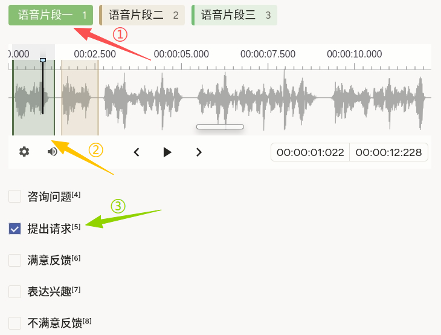
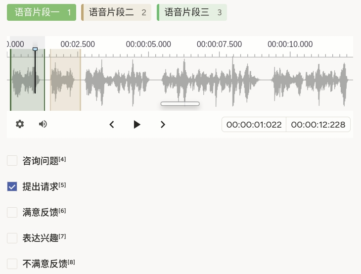

# 意图分类使用说明

可以理解为「先把长音频**切成几段**，再对**每一段**进行意图分类。与 [使用片段的自动语音识别](./automatic-speech-recognition-using-segments/)（语音/噪音 + 转写）不同，本模版**不写转写**，只做**区段 + 意图**分类。

## 标注核心作用

1.  `Labels` 提供 **语音片段一 / 二 / 三** 等，用于在 `Audio` 上创建带类型的区段（名称可按项目改写）；
2.  `Choices` 使用 `perRegion="true"`，选项随**当前选中区段**切换；
3.  `required="true"` 要求每个区段完成意图选择后再提交（以平台校验为准）。

## 基础操作步骤

1.  阅读任务说明，明确各「语音片段」标签与意图类别的含义；
2.  在顶部选择一种片段标签，在波形上拖选时间范围；可换标签标下一段；
3.  点击高亮的区段后，在下方会显示意图列表；
4.  在意图列表中勾选一项对该区段完成意图标注。



说明：对所有区段完成意图标注后方可提交。

## 注意事项

- `data.audio` 须为可访问的音频路径；字段名与 `value="$audio"` 一致；
- 若 `Choices` 未显式写 `choice="single"`，多选行为以平台默认为准；意图互斥时建议在配置中改为单选；
- 三个片段标签仅为示例，可增删 `Label` 以匹配业务分段策略；
- 需要**文本转写**时请改用带 `TextArea` 的模版（见 [使用片段的自动语音识别](./automatic-speech-recognition-using-segments/)）。

## 模板预览



## 模板配置
### 完整代码块

```html
<View>
  <Labels name="labels" toName="audio">
    <Label value="语音片段一" />
    <Label value="语音片段二" />
    <Label value="语音片段三" />
  </Labels>

  <Audio name="audio" value="$audio"/>

  <Choices name="intent" toName="audio" perRegion="true" required="true">
    <Choice value="咨询问题" />
    <Choice value="提出请求" />
    <Choice value="满意反馈" />
    <Choice value="表达兴趣" />
    <Choice value="不满意反馈" />
  </Choices>
</View>
```

### 配置代码说明

以上代码为「片段类型标签 + 音频 + 按区段意图选择」。

1、标签：`Labels name="labels" toName="audio"` 声明可在波形上创建的区段类型名称。

2、音频：`Audio name="audio" value="$audio"` 从任务数据的 **`audio` 字段**加载。

3、意图：`Choices name="intent" toName="audio"` 与音频对象绑定；`perRegion="true"` 表示每个区段独立选择；`required="true"` 控制必填。

### 示例数据（简要）

```json
{
  "data": {
    "audio": "/static/templates/project-samples/intent-classification.mp3"
  }
}
```

说明

- 代码可直接复制到标注配置文件中使用；
- 请将示例路径替换为实际上传或可访问的音频地址。
