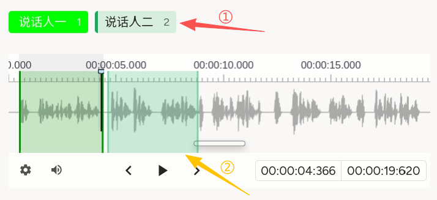
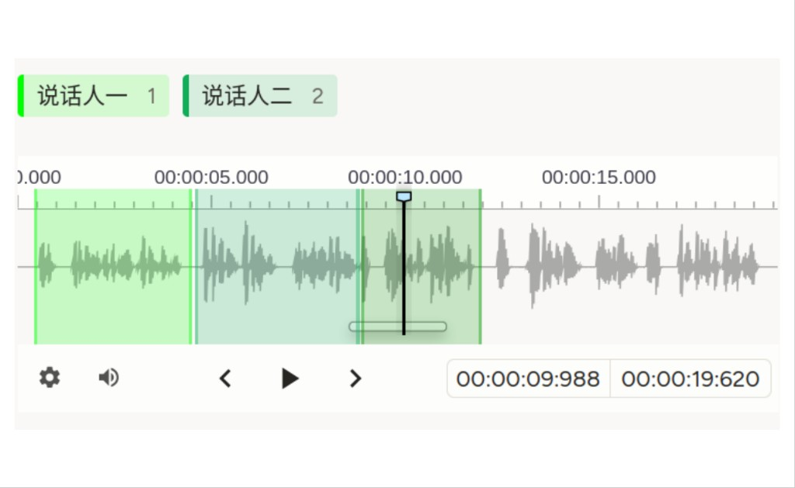

# 说话人分割使用说明

可以理解为「**谁在什么时候说话**」：在一条录音里，用两种颜色在时间上标出**说话人甲**、**说话人乙**的片段（可多次交替）。与 [对话分析](./conversational-analysis/)（已带 `author`+时间+正文的气泡）不同，这里**只有波形区段**；与 [声音事件监测](./sound-event-detection/) 的交互类似，但标签语义是**说话人**而不是泛化「事件」。

## 标注核心作用

1.  两类标签常对应两个说话人，颜色用强对比（如亮绿与深绿）减少混淆；
2.  可连续多段、交替标同一说话人，以覆盖**多人轮流发言**的长音频；
3.  为下游 **diarization**、说话人相关 ASR 或质检提供**时间掩码**级标注。

## 基础操作步骤

1.  听全段，熟悉每人嗓音与交替节奏，明确「说话人一 / 二」在规范中的指代；
2.  选择当前要标的说话人标签；
3.  在波形上拖选该说话人发声的起止；换人时切换另一标签，重复至覆盖需标注的区间；
4.  必要时微调区段边界，与项目边界规则一致后提交。



说明：截图中①示意选中的「说话人二」等标签；②示意波形上对应该说话人的区段。

## 注意事项

- `data.audio` 须可访问；示例使用与会话类示例相同的 `conversation.mp3` 时，**路径按部署实际替换**；
- 说话人超过两位时，请增加 `Label` 并区分颜色与培训说明；
- `Labels` 上 `zoom`、`hotkey` 是否生效以平台为准，参见 [声音事件监测](./sound-event-detection/) 中同类说明；
- 若需**逐句转写**或**话轮级情感**，可叠加 [使用片段的自动语音识别](./automatic-speech-recognition-using-segments/) 或 [对话分析](./conversational-analysis/) 等流程。

## 模板预览



## 模板配置
### 完整代码块

```html
<View>
  <Labels name="label" toName="audio" zoom="true" hotkey="ctrl+enter">
    <Label value="说话人一" background="#00FF00"/>
    <Label value="说话人二" background="#12ad59"/>
  </Labels>
  <Audio name="audio" value="$audio" />
</View>
```

### 配置代码说明

以上代码为「说话人标签 + 音频」，与 [声音事件监测](./sound-event-detection/) 结构一致，仅 `Label` 文案与色值不同。

1、标签：`Labels name="label" toName="audio"` 指定区段类型为说话人；`background` 为十六进制颜色。

2、音频：`Audio name="audio" value="$audio"` 从任务数据的 **`audio` 字段**加载。

### 示例数据（简要）

```json
{
  "data": {
    "audio": "/static/templates/project-samples/conversation.mp3"
  }
}
```

说明

- 代码可直接复制到标注配置文件中使用；
- 请将路径替换为实际上传或静态资源中的音频地址。
