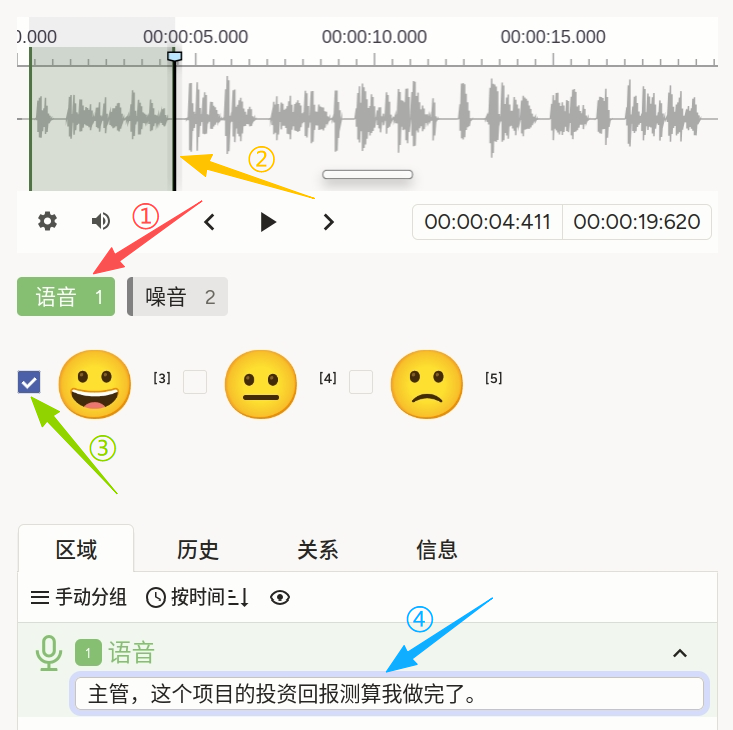
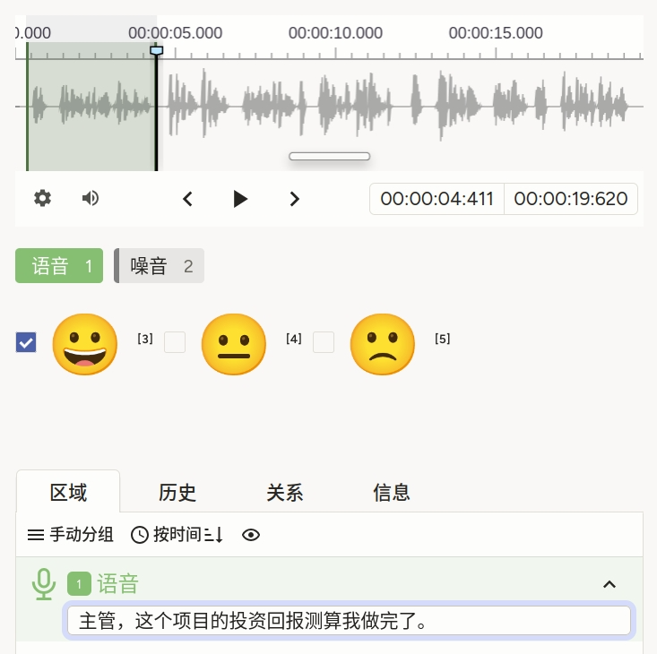

# 语音转录使用说明

可以理解为「先像 [使用片段的自动语音识别](./automatic-speech-recognition-using-segments/) 一样**划区**，选择每个语音区的情感态度，并进行语音转写」。「噪音」区一般只做时间标记，不强制跟转写和情感。适合**分段 ASR + 话段情感**联合标注。

## 标注核心作用

1.  `whenTagName="label" whenLabelValue="语音"` 使 `TextArea` 与 `Choices` **仅在「语音」区段**展示，避免在噪音区误填；
2.  `displayMode="region-list"` 把转写放在**区域列表面板**中，便于多段管理；
3.  `Choice` 使用 `html` 嵌入大表情，提升点选速度。

## 基础操作步骤

1.  听全段，熟悉每人嗓音与交替节奏；
2.  选中不同的标签，并在波形图上标注对应的片段；
3.  点击对应的片段，即可出现情感划分选项，在同一区段为 **积极 / 中性 / 消极** 择一；
4.  在底部「区域」列表中找到对应条目，在文本框中输入该段转写；
5.  多段重复上述操作后提交。



说明：「操作步骤3」和「操作步骤4」可交换顺序。

## 注意事项

- `data.audio` 须可访问；示例为 `conversation.mp3`，与 [对话分析](./conversational-analysis/) 中示例可共用同一条音轨，路径按部署调整；
- `whenTagName="label"` 与你在 `Labels` 上使用的 `name="label"` 一致；若重命名 `Labels`，需同步改 `whenTagName`；
- 表情以 Unicode/HTML 方式写在 `Choice` 的 `html` 中，若需无障碍或纯文字，可改回无 `html` 的 `value` 展示；
- 与仅转写、无情感的 [使用片段的自动语音识别](./automatic-speech-recognition-using-segments/) 相比，本模版**交互更重**，适合明确需要「段级情感」的数据管线。

## 模板预览



## 模板配置
### 完整代码块

```html
<View>
  <Audio name="audio" value="$audio" />
  <Labels name="label" toName="audio">
    <Label value="语音"/>
    <Label value="噪音" background="grey"/>
  </Labels>
  <TextArea name="transcription" toName="audio"
            perRegion="true" whenTagName="label" whenLabelValue="语音"
            displayMode="region-list"/>
  <Choices name="sentiment" toName="audio" showInline="true"
           perRegion="true" whenTagName="label" whenLabelValue="语音">
    <Choice value="积极" html="&lt;span style='font-size: 45px; vertical-align: middle;'&gt; &#128512; &lt;/span&gt;"/>
    <Choice value="中性" html="&lt;span style='font-size: 45px; vertical-align: middle;'&gt; &#128528; &lt;/span&gt;"/>
    <Choice value="消极" html="&lt;span style='font-size: 45px; vertical-align: middle;'&gt; &#128577; &lt;/span&gt;"/>
  </Choices>
</View>
```

### 配置代码说明

以上代码为「音频 + 语音/噪音 + 条件显示的按区转写 + 按区情感」。

1、音频与区段类型：`Audio` 与 `Labels toName="audio"` 同前；`语音` 不设 `background` 时由平台默认色，`噪音` 为灰色。

2、转写：`TextArea` 的 `perRegion="true"` 表示每区一条；`whenLabelValue="语音"` 表示仅**语音**区出现输入；`displayMode="region-list"` 在区域列表中展示。

3、情感：`Choices` 同样 `perRegion` 且仅在语音区；`showInline="true"` 横向排列；`html` 内嵌表情符号。

### 示例数据（简要）

```json
{
  "data": {
    "audio": "/static/templates/project-samples/conversation.mp3"
  }
}
```

说明

- 代码可直接复制到标注配置文件中使用；
- 请将 `audio` 路径替换为实际上传或静态资源地址。
