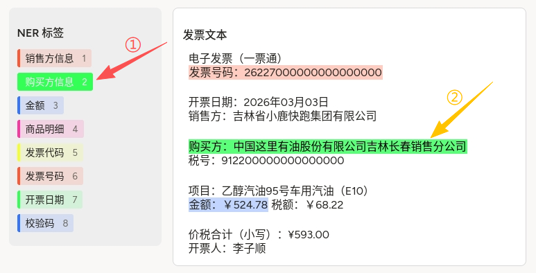
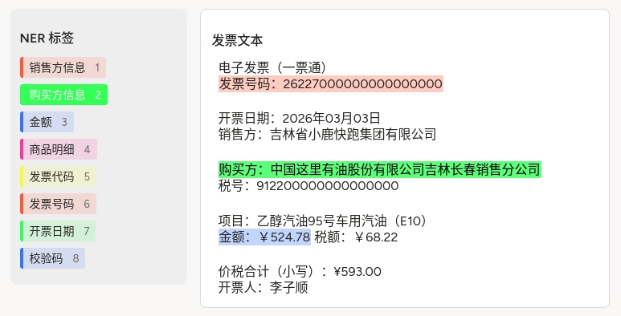

# 发票命名实体标注（BIO 形式）使用说明

可以理解为「查看 OCR 后的发票正文，并选择实体类型后，在文本上按划选对应片段」。标注结果在平台内多为**区间 + 类型**；若在训练脚本中将每个词映射为 **B-类型 / I-类型 / O**，即常见的 **BIO（或 BIOES）序列标注**流程。本配置源自社区模版库，适合作为发票信息抽取的起点。

## 标注核心作用

1.  **Flex 布局**将标签列表与正文区分左右，长文本时右侧可纵向滚动（`max-height: 80vh; overflow-y: auto`）；
2.  `Labels` + `Text`（非 HyperText）直接处理**纯文本** `$ocr`，与常见 OCR 管道输出一致；
3.  `granularity="word"` 约束选区对齐到词界，有利于与 **BIO** 词级标签对齐（具体分词规则以平台与下游脚本为准）。

## 基础操作步骤

1.  阅读项目规范，明确八类标签各自覆盖的字符串范围（是否含「发票号码：」前缀等）；
2.  在左侧选中一类标签（如「购买方信息」）；
3.  在右侧「发票文本」中划选对应片段；重复直至字段标全或按任务要求结束；
4.  自检漏标、跨行截断等问题后提交。



说明：截图中①示意当前选中的标签；②示意该标签在正文中的高亮片段。

## 注意事项

- `data.ocr` 为**纯文本**字符串，换行用 `\n` 写入 JSON；若含引号需转义；
- 「BIO 形式」通常指**导出后**由脚本将标注转为 B-/I-/O 序列；若需平台内直接导出 BIO，请核对平台能力与字段格式；
- 配置中部分 `background` 颜色在不同标签间重复（如 `#FF5733`），仅影响色块区分度，必要时可在团队中微调以免混淆；
- 本模版标注为社区参考配置（见下方代码注释出处），接入生产前请做版本与字段校验。

## 模板预览



## 模板配置
### 完整代码块

```html
<View style="display: flex; align-items: flex-start; gap: 1em;">

  <!-- 左侧：标签面板 -->
  <View style="width: 220px; min-width: 220px; padding: 12px; background: #eeeeee; border-radius: 8px;">
    <Header value="NER 标签" />
    <Labels name="ner" toName="text" showInline="false">
      <Label value="销售方信息"    background="#FF5733" />
      <Label value="购买方信息"   background="#33FF57" />
      <Label value="金额"   background="#3375FF" />
      <Label value="商品明细"  background="#FF33A1" />
      <Label value="发票代码" background="#F3FF33" />
      <Label value="发票号码"    background="#FF5733" />
      <Label value="开票日期"   background="#33FF57" />
      <Label value="校验码"   background="#3375FF" />
    </Labels>
  </View>

  <!-- 右侧：发票文本区域 -->
  <View style="flex: 1; padding: 14px; background: #ffffff; border: 1px solid #d9d9d9; border-radius: 8px; max-height: 80vh; overflow-y: auto;">
    <Header value="发票文本" />
    <Text
      name="text"
      value="$ocr"
      granularity="word"
    />
  </View>
</View>
```

### 配置代码说明

以上代码为「左侧纵向标签列表 + 右侧可滚动纯文本 + 词粒度标注」。

1、布局：根 `View` 使用 `display: flex` 与 `gap`，左栏固定宽度、右栏 `flex: 1` 占满剩余空间。

2、标签：`Labels name="ner" toName="text"` 与 `Text name="text"` 绑定；`showInline="false"` 使标签纵向排列。

3、正文：`Text` 的 `value="$ocr"` 从任务数据的 **`ocr` 字段**加载；`granularity="word"` 表示以词为最小选区单位。

### 示例数据（简要）

```json
{
  "data": {
    "ocr": "电子发票（一票通）\n发票号码：26227000000000000000\n\n开票日期：2026年03月03日\n销售方：吉林省小鹿快跑集团有限公司\n\n购买方：中国这里有油股份有限公司吉林长春销售分公司\n税号：912200000000000000\n\n项目：乙醇汽油95号车用汽油（E10）\n金额：￥524.78  税额：￥68.22\n\n价税合计（小写）：¥593.00\n开票人：李子顺"
  }
}
```

说明
- 代码可直接复制到标注配置文件中使用；
- 出处：配置注释中的 **awesome-label-studio-config** 仓库路径仅供参考，若上游有更新请以源仓库为准。
