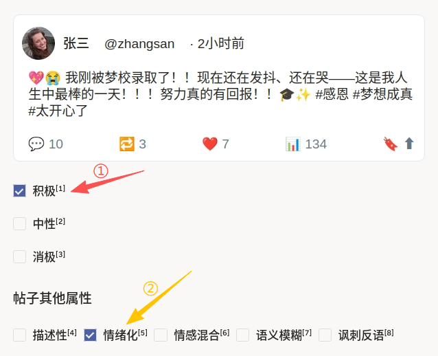
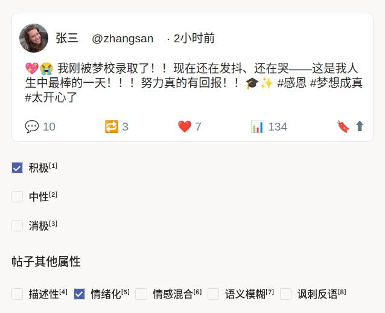

# X/Twitter 帖子的两级情感分析使用说明

可以理解为「看一条帖子的正文，**先判整体情感**，再勾**写作风格或语义特点**」。第一层与第二层拆开，可减少一次界面上的选项数量，并符合「先主类、后附加属性」的质检习惯。本配置源自社区模版库。

## 标注核心作用

1.  顶部 **Style** 微调 `.htx-text`，避免在旧版 playground 中与卡片样式冲突；
2.  卡片用嵌套 `View` + `Text` 拼出头像、昵称、时间与互动数据，**仅正文**来自 `$text`，其余可为演示固定值；
3.  `Choices name="sentiment"` 使用 `choice="single"`，绑定到承载正文的 `Text name="tweet"`；
4.  `Choices name="other-props"` 使用 `choice="multiple"`，并通过 `visibleWhen="choice-selected"`、`whenTagName="sentiment"` 在选中主情感后再显示第二组选项。

## 基础操作步骤

1.  阅读主情感三项的，在 **积极 / 中性 / 消极** 中择一；
2.  出现「帖子其他属性」后，按需勾选一项或多项（描述性、情绪化等），并参考各 `hint`；
3.  若项目要求必选第二组，请在规范中写明；当前配置未对第二组强制 `required`（以实际 XML 为准）；
4.  自检后提交。



说明：截图中①示意第一层主情感选择；②示意第二层「帖子其他属性」多选（界面标号以实际为准）。

## 注意事项

- `data.text` 为帖子正文；头像 URL、互动数字等为模版内写死的展示字段，批量任务时若需**每帖不同**，应改为变量并在 JSON 中传入（需同步改配置）；
- `showInLine` 若在你使用的平台中无效，可尝试改为 `showInline`（以官方文档拼写为准）；
- `toName="tweet"` 须与正文 `Text name="tweet"` 一致，否则选项无法正确关联；
- 出处见下方代码注释；升级 Label Studio 大版本后请回归测试 `visibleWhen` 行为。

## 模板预览



## 模板配置
### 完整代码块

```xml
<View>
  <Style>
    .htx-text{padding:0; background: transparent; border:none;}
  </Style>
  <View 
    style="
      border: 1px solid #e1e8ed;
      border-radius: 8px;
      padding: 10px;
      max-width: 500px;
      background-color: #fff;
      font-family: Arial, sans-serif;
    "
  >
    <View 
      style="
        display: flex;
        align-items: center;
        gap: 10px;
      "
    >
      <View 
        style="
          width: 40px;
          height: 40px;
          border-radius: 50%;
          background-color: #ccc;
          background-image: url('https://randomuser.me/api/portraits/women/45.jpg');
          background-size: cover;
        "
      ></View>
      <Header name="username" value="张三" />
      <Text name="handle" value="@zhangsan" style="color:gray;" />
      <Text name="timestamp" value="· 2小时前" style="color:gray;" />
    </View>
    <View style="margin-top: 8px;">
      <Text name="tweet" value="$text" />
    </View>
    <View 
      style="
        display: flex;
        justify-content: space-between;
        font-size: 12px;
        color: #657786;
        margin-top: 20px;
      "
    >
      <Text name="comments" value="💬 10" />
      <Text name="retweets" value="🔁 3" />
      <Text name="likes" value="❤️ 7" />
      <Text name="views" value="📊 134" />
      <Text name="other" value="🔖 ⬆" />
    </View>
  </View>

  <Choices name="sentiment" toName="tweet" choice="single">
    <Choice value="积极" hint="如果内容表达正向、积极态度，请选择此项" />
    <Choice value="中性" hint="如果整体不表达明显情绪倾向，请选择此项" />
    <Choice value="消极" hint="如果内容表达负向、不满或不愉快情绪，请选择此项" />
  </Choices>

  <Choices name="other-props" toName="tweet"
           choice="multiple" showInLine="true"
           visibleWhen="choice-selected"
           whenTagName="sentiment">
    <View style="width:100%">
      <Header value="帖子其他属性" />
    </View>
    <Choice value="描述性" />
    <Choice value="情绪化" hint="如果表达了中等到强烈的情绪，请选择此项" />
    <Choice value="情感混合" hint="如果同时出现多种相互冲突的情绪，请选择此项"/>
    <Choice value="语义模糊" hint="如果内容无关、难以判断或语义不清，请选择此项"/>
    <Choice value="讽刺反语" hint="如果内容包含讽刺、反讽或挖苦表达，请选择此项"/>
  </Choices>
</View>
```

### 配置代码说明

以上代码为「仿推文卡片 + 主情感单选 + 条件显示的多选属性」。

1、卡片：外层 `View` 控制边框与最大宽度；头像为 CSS `background-image`；`Text name="tweet" value="$text"` 为唯一数据驱动正文。

2、第一层：`Choices name="sentiment" toName="tweet"` 将情感标签关联到 `tweet` 文本对象；各 `Choice` 可配 `hint` 作为悬浮说明。

3、第二层：`name="other-props"`，`visibleWhen="choice-selected"` 与 `whenTagName="sentiment"` 表示在 `sentiment` 有选项被选中后再显示本组；`choice="multiple"` 为多选。

### 示例数据（简要）

```json
{
  "data": {
    "text": "💖😭 我刚被梦校录取了！！现在还在发抖、还在哭——这是我人生中最棒的一天！！！努力真的有回报！！🎓✨ #感恩 #梦想成真 #太开心了"
  }
}
```

说明

- 代码可直接复制到标注配置文件中使用；
- 注释中的 **awesome-label-studio-config** 路径仅供参考；配置内「plaground」为上游拼写，若本地修改样式可一并校正。
