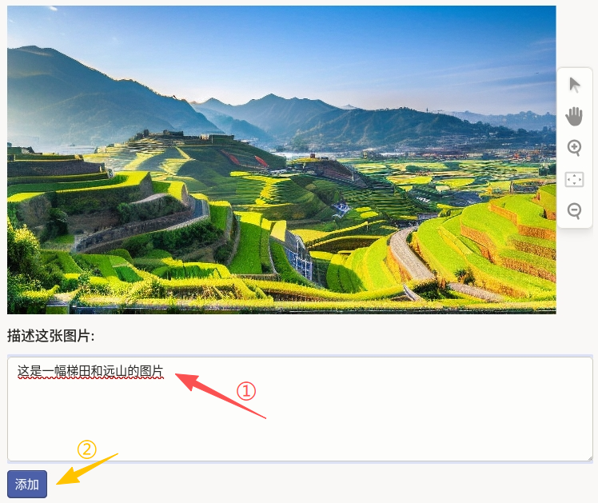
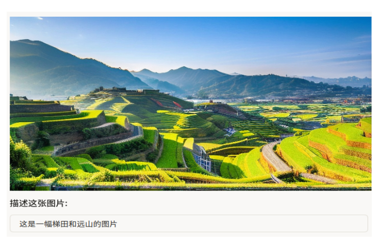

# 图像描述使用说明

图像描述可以理解为“看图写话”：在界面中查看图片，在提示语下方用自然语言写出对画面内容的概括或细节描述。它适合风景、人物、活动、物体等通用图像，常用于图像字幕生成、图文检索、多模态预训练与视觉语言模型对齐等任务。

## 标注核心作用

1.  构建图文配对数据：为每张图提供可读、可训练的文字说明；
2.  标注成本低：无需框选或逐像素标注，适合大规模数据生产；
3.  表达灵活：可侧重主体、场景、氛围或动作，按项目规范统一即可。

## 基础操作步骤

1.  查看整张图片，必要时使用右侧工具栏放大或缩小；
2.  在「描述这张图片:」下方的输入框中撰写描述；
3.  检查表述是否与画面一致，点击添加按钮完成提交。



说明：描述宜客观、完整，避免与画面无关的主观发挥；若项目要求固定句式或长度，请按规范书写。

## 注意事项

- 描述应覆盖画面主要信息，避免只写单一细节而忽略主体；
- 专有名词、数量、颜色等尽量与画面一致，不确定时可按项目约定标注；
- 同一数据集内保持描述风格一致（如是否使用完整句、是否包含「图中」等引导词）。

## 模板预览



## 模板配置
### 完整代码块

```html
<View>
  <Image name="image" value="$image_path" zoom="true"/>
  <Header value="描述这张图片:"/>
  <TextArea name="caption" toName="image" placeholder="在此输入描述..."
            rows="5" maxSubmissions="1"/>
</View>
```

### 图像描述配置代码说明

以下代码用于实现「图像 + 单行或多行文字描述」的标注流程，可直接复制使用。

1、图片组件：`Image` 加载待描述图片，`zoom="true"` 表示支持缩放查看细节。

```html
<Image name="image" value="$image_path" zoom="true"/>
```

2、提示文案：`Header` 用于在输入框上方展示引导语，可按项目修改为其他提示。

3、描述输入：`TextArea` 绑定到图片（`toName="image"`），`rows="5"` 提供多行输入；`maxSubmissions="1"` 限制每条任务提交一条描述，避免重复录入。

```html
<TextArea name="caption" toName="image" placeholder="在此输入描述..."
          rows="5" maxSubmissions="1"/>
```

说明
- 代码可直接复制到标注配置文件中使用；
- 可按需要调整 `placeholder`、`rows` 或提示文案；
- 若需**多条独立候选描述**（例如每人写两条不同说法），可将 `maxSubmissions` 调大以允许多次提交；或在同一 `View` 内增加多个 `TextArea`（不同 `name`）。扩展示例见下方代码块，可直接复制后按需修改。

```html
<View>
  <Image name="image" value="$image_path" zoom="true"/>
  <Header value="描述这张图片（两条候选）："/>
  <TextArea name="caption_1" toName="image" placeholder="候选描述一..."
            rows="3" maxSubmissions="1"/>
  <TextArea name="caption_2" toName="image" placeholder="候选描述二..."
            rows="3" maxSubmissions="1"/>
</View>
```
