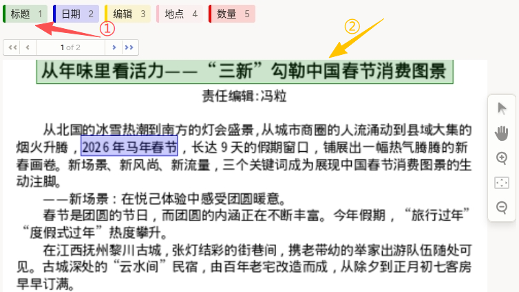
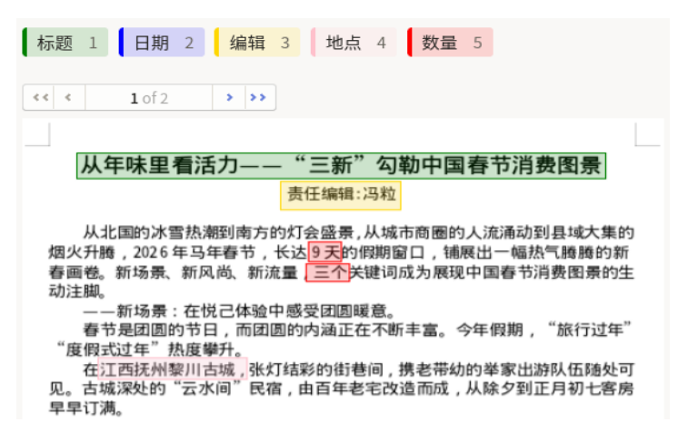

# 多页文档标注使用说明

多页文档标注可以理解为“按页翻看文档，再框选关键信息”：在文档的每一页中选择对应标签（如标题、日期、编辑、地点、数量），并用矩形框标出目标文本区域，输出可用于信息抽取的结构化标注结果。它适合新闻稿、报告、表单、票据等跨页文档场景，常用于字段检测、版面解析与文档自动化处理任务。

## 标注核心作用

1.  支持跨页连续标注：可在同一任务中逐页处理文档内容，避免页间信息割裂；
2.  便于字段级信息提取：通过标签与框选区域绑定，形成可训练的数据样本；
3.  提升文档结构化效率：对固定字段进行规范标注，降低后续抽取与质检成本。

## 基础操作步骤

1.  在顶部标签区选择字段类型（如“标题”“日期”等）；
2.  在当前页框选对应文本区域；
3.  切换到下一页后重复标注，直至完成所有页。



说明：建议先完成当前页全部字段再翻页，便于保持字段标准一致。

## 注意事项

- 框选区域尽量紧贴文本边界，避免框入过多空白或相邻字段；
- 同类字段在不同页面保持一致标注口径（如“日期”是否包含分隔符）；
- 多页文档中若字段缺失，可跳过该字段但保持标签体系不变。

## 模板预览



## 模板配置
### 完整代码块

```html
<View>
  <RectangleLabels name="rectangles" toName="pdf" showInline="true">
    <Label value="标题" background="green" />
    <Label value="日期" background="blue" />
    <Label value="编辑" background="gold"/>
    <Label value="地点" background="pink"/>
    <Label value="数量" background="red"/>
  </RectangleLabels>
  <Image valueList="$pages" name="pdf"/>
</View>
```

### 多页文档标注配置代码说明

以下代码用于实现多页文档的字段框选标注，可直接复制使用。

1、标签组件：`RectangleLabels` 用于定义字段标签集合，`showInline="true"` 表示标签以内联方式展示，便于快速切换。

```html
<RectangleLabels name="rectangles" toName="pdf" showInline="true">
  <Label value="标题" background="green" />
  <Label value="日期" background="blue" />
  <Label value="编辑" background="gold"/>
  <Label value="地点" background="pink"/>
  <Label value="数量" background="red"/>
</RectangleLabels>
```

2、多页图像来源：`Image valueList="$pages"` 表示按页加载文档图像列表，用于逐页标注。

```html
<Image valueList="$pages" name="pdf"/>
```

说明
- 代码可直接复制到标注配置文件中使用；
- 可按实际业务增删 `Label` 项并调整颜色；
- 若文档页数较多，建议制定“逐页复核”流程保证标注一致性。
