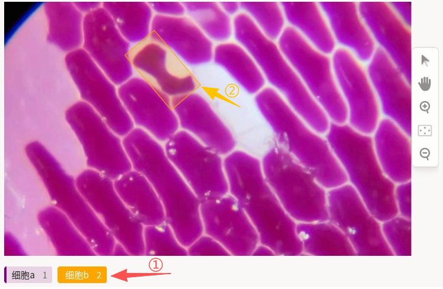
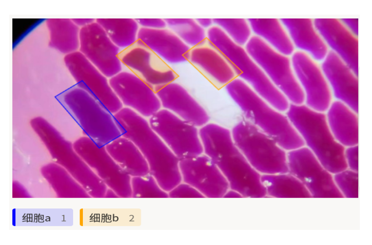

# 目标检测使用说明

基于矩形框的目标检测，其实就是“先选标签，再把目标框出来”：先在标签栏选好类别，再在图像里用矩形框圈住目标，最终得到“位置 + 类别”的检测标注。它适合需要快速完成目标定位与分类的场景，比如细胞、车辆、行人、缺陷点等，常用于显微影像、自动驾驶、工业质检、遥感解译等任务。

## 标注核心作用

1.  快速完成目标定位与分类：用矩形框标出目标大致范围并绑定标签，为检测类模型提供标准训练数据；
2.  适配多目标、多类别：同一图像中可绘制多个框，不同颜色/标签区分不同类别；
3.  标注成本与精度平衡：在不需要轮廓级精度时，矩形框标注效率更高，便于大规模数据生产。

## 基础操作步骤

1. 在底部标签栏选择要标注的类别（不同标签对应不同颜色）；
2. 在图像上按住拖拽，绘制覆盖目标的矩形框。


说明：双击选中已有框后可进行旋转，调整大小或位置，或删除后重新标注。

## 注意事项

- 矩形框应尽量紧贴目标外接范围，避免框过大包含过多背景或框过小遗漏目标；
- 同一类别多个实例需分别框选，每个框选择对应标签；
- 标注过程中可随时撤销、修改或删除已绘制的框。

## 模板预览



## 模板配置

### 完整代码块

```html
<View>
  <Image name="image" value="$image_path" zoom="true"/>
  <RectangleLabels name="label" toName="image">
    <Label value="细胞a" background="purple"/>
    <Label value="细胞b" background="orange"/>
  </RectangleLabels>
</View>
```
### 目标检测矩形框标注配置代码说明

以下代码用于实现基于矩形框的目标检测标注功能，可直接复制使用，关键部分可根据实际标注需求修改。

1、加载需要标注的图片，`zoom="true"` 表示支持图片缩放，无需修改。

```html
<Image name="image" value="$image_path" zoom="true"/>
```

2、矩形框标注核心配置，定义标签名称与显示颜色

<!--TODO: 以下关键字和标签等，可设计为跳转链接，跳转到本网站的相关内容，例如：[lable]() https://github.com/jujidata/jujidata-docs/issues/9 -->

- `RectangleLabels` 为矩形框标注组件，需通过 `toName="image"` 与上方图片组件关联。
- `Label` 的 `value` 为类别名称，可按业务修改为任意标签文案。
- `background` 为该类标签在界面上的颜色（如 `purple`、`orange`），用于区分不同类别。

```html
<RectangleLabels name="label" toName="image">
  <Label value="细胞a" background="purple"/>
  <Label value="细胞b" background="orange"/>
</RectangleLabels>
```

说明：
- 代码可直接复制到标注配置文件中使用；
- 按需增删 `Label` 行即可扩展或缩减类别；
- 若需额外引导文案，可在 `<View>` 内于 `<Image>` 前增加 `<Header value="..."/>` 等组件。

