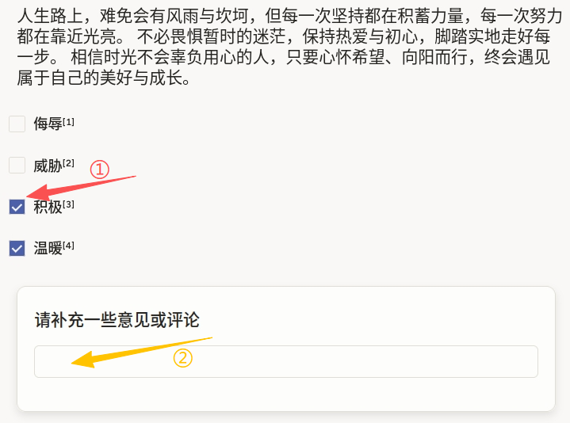
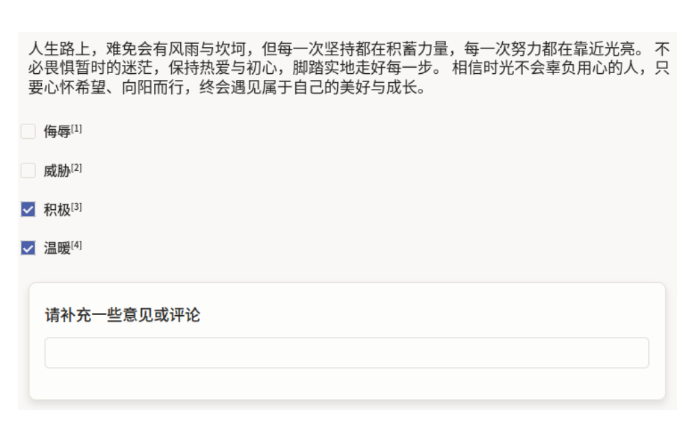

# 内容审核使用说明

内容审核可以理解为“先判断文本涉及哪些类别，再补充审核意见”：标注员先阅读文本内容，勾选一个或多个标签（如侮辱、威胁、积极、温暖），再在评论框写下必要说明，用于支撑判定依据或记录边界情况。

## 标注核心作用

1.  支持多标签判定：同一文本可同时命中多个类别，贴合真实审核场景；
2.  保留人工解释：评论字段可沉淀判定依据，便于质检复核；
3.  适配策略优化：标签与评论结合后，可用于规则迭代与模型微调。

## 基础操作步骤

1.  通读文本，判断文本类别；
2.  在标签区勾选一个或多个标签；
3.  可以在“请补充一些意见或评论”区域填写说明，回车即可添加评论；
4.  提交前复核标签是否漏选、评论是否清晰。



说明：若文本同时包含冲突信号（如“积极”与“威胁”并存），应按项目规范保留多标签并在评论中解释上下文。

## 注意事项

- `choice="multiple"` 表示多选模式，若业务改为互斥判定需调整为单选；
- 标签定义需配套审核准则（命中条件、例外条件、优先级）；
- 评论建议聚焦“为什么命中该标签”，避免无信息量描述。

## 模板预览



## 模板配置
### 完整代码块

```html
<View>
  <Text name="text" value="$text"/>

  <Choices name="content_moderation" toName="text" choice="multiple" showInline="false">
    <Choice value="侮辱" background="red"/>
    <Choice value="威胁" background="brown"/>
    <Choice value="积极" background="orange"/>
    <Choice value="温暖" background="pink"/>
  </Choices>

  <View style="margin: var(--spacing-tight); box-shadow: 0 4px 8px rgba(var(--color-neutral-shadow-raw) / 10%); padding: var(--spacing-tight) var(--spacing-base); border-radius: var(--corner-radius-small); background-color: var(--color-neutral-background); border: 1px solid var(--color-neutral-border);">
    <Header value="请补充一些意见或评论"/>
    <TextArea name="comments" toName="text" required="false"/>
  </View>
</View>
```

### 内容审核配置代码说明

以上代码用于实现“文本审核 + 多标签分类 + 备注说明”的联合标注流程。

1、文本组件：`Text name="text" value="$text"` 用于加载待审核文本。

2、标签组件：`Choices name="content_moderation"` 绑定文本对象；`choice="multiple"` 允许多选；`showInline="false"` 以纵向列表展示，适合审核类逐项判断。

3、评论组件：`TextArea name="comments"` 用于补充审核意见；`required="false"` 表示评论非必填，可按项目需要改为必填。

### 示例数据（简要）

以下示例中的 `text` 为单行字符串，可直接用于模板调试。

```json
{
  "data": {
    "text": "人生路上，难免会有风雨与坎坷，但每一次坚持都在积蓄力量，每一次努力都在靠近光亮。不必畏惧暂时的迷茫，保持热爱与初心，脚踏实地走好每一步。相信时光不会辜负用心的人，只要心怀希望、向阳而行，终会遇见属于自己的美好与成长。"
  }
}
```

说明
- 代码可直接复制到标注配置文件中使用；
- 标签项可替换为业务风险类别（如广告、涉政、暴力、辱骂等）；
- 若需要“有命中标签时评论必填”，可在项目规则中增加校验逻辑。
