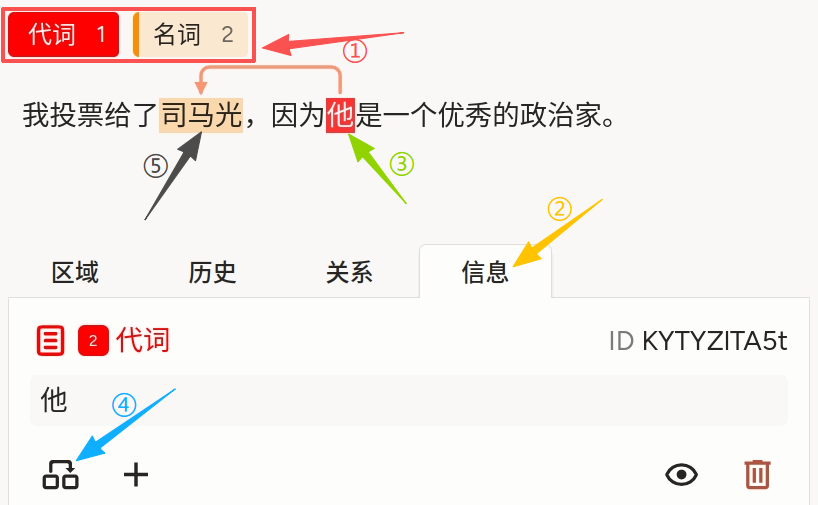
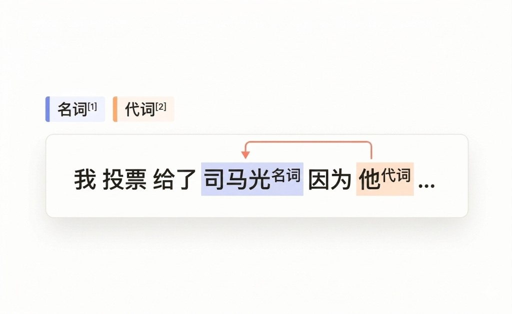

# 共指消解和实体链接使用说明

* 可以理解为「在文中标出代词与名词等提及，并在需要时用连线表达**同一实体**上的指代关系」。
* 与 [关系抽取](../natural-language-processing/relation-extraction/) 相比：**关系抽取**回答的是「两个跨度之间属于哪一种**预定义语义关系**」（如人物—就职—机构），连线可定义关系类型，侧重图谱或事件结构中的**有类型边**；
* **共指消解**回答的是「两个跨度是否在指称**同一对象**」，连线表示指代链或共指簇，侧重**同指/代词先行词**，通常不依赖一整套业务关系枚举。**实体链接**则常在名词提及侧对齐知识库标准条目（ID、规范名等）。它适合新闻、对话、评论等需要消解「他/她/其」指向的语料，也可作为实体链接流水线的前置跨度标注。

## 标注核心作用

1.  显式区分代词与名词短语，降低共指模型学习的类别混淆；
2. 使用 `confText` 字段可与对话配置、任务说明等上游数据对齐；
3.  与关系标注配合时，可导出「提及对 + 指代」结构，便于评测与训练。

## 基础操作步骤

1.  点选实体类型标签，并在文本中拖选对应片段完成实体标注（至少需要两个标注的实体才能进行实体链接）；
2.  在下方面板切换到「信息」板块；
3.  选中其中一个实体作为链接一端的区域；
4.  点击关系图标，即可创建关系；
5.  最后点击另一个实体，就能完成关系链接。



说明：截图中的①—⑤为示意流程。若仅使用下文「完整代码块」中的配置（仅含 `Labels` 与 `Text`），则完成的是实体类别与跨度标注；**若要在导出结果中保留指代连线，请在项目模版中增加 `Relations` 等关系配置**，并与质检规则一并约定方向与允许多重边等细节。

## 注意事项

- 实体边界尽量紧凑，勿将逗号、助词等无关字一并选入；
- 「名词」侧若存在多个候选先行词，需按规范选择唯一链接或允许多重边；
- `confText` 建议保持单行字符串，便于与字符偏移校验；
- 实体链接到知识库 ID 时，可在数据字段或扩展组件中补充标准名、URI 等，与本模版标签并行使用。

## 模板预览



## 模板配置
### 完整代码块

```html
<View>
  <Labels name="label" toName="text">
    <Label value="代词" background="red"/>
    <Label value="名词" background="darkorange"/>
  </Labels>

  <Text name="text" value="$confText"/>
</View>
```

### 配置代码说明

以上代码用于在单段文本上完成「代词 / 名词」类别的跨度标注，正文由数据字段 `confText` 注入。

1、标签组件：`Labels name="label" toName="text"` 将标签绑定到文本；先选「代词」或「名词」，再在句中划选片段即可生成区域结果。

2、文本组件：`Text name="text" value="$confText"` 从样本数据的 `confText` 字段读取待标注字符串，适合与对话模版、任务配置等命名保持一致。

3、扩展：若需与截图一致的关系连线，请在 `View` 内按需添加 `Relations` 及若干 `Relation value="..."`，并在标注规范中定义关系语义与方向。

### 示例数据（简要）

以下示例与截图语句一致，`confText` 建议保持单行。

```json
{
  "data": {
    "confText": "我投票给了司马光，因为他是一个优秀的政治家。"
  }
}
```

说明
- 代码可直接复制到标注配置文件中使用；
- 修改 `Label` 颜色或取值后，请同步培训材料与质检规则；
- 若数据字段改用 `text` 等命名，请同步修改 `value="$confText"` 中的变量名。