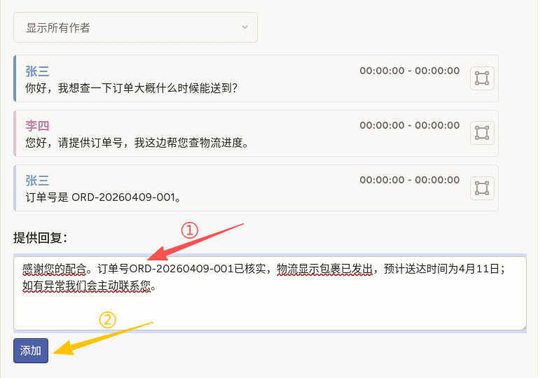
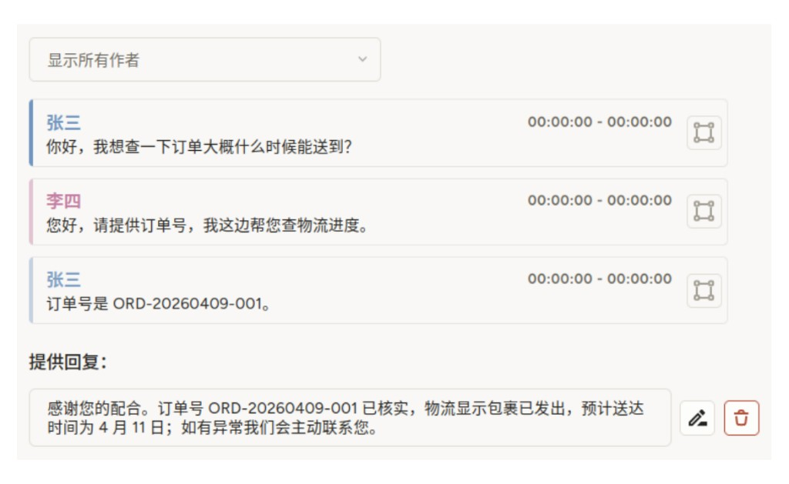

# 响应生成使用说明

可以理解为「读完上面的多轮对话后，在下方文本框里写出最合适回复的内容」。它适合需要**开放式字符串标签**的对话生成、话术润色与模型对齐数据构建。

## 标注核心作用

1.  输出与上下文连贯的自然语言回复，可直接用于评测集或人工基线；
2.  `TextArea` 与 `Paragraphs` 绑定（`toName="chat"`），导出时可将回复与对话对象关联；
3.  `maxSubmissions` 可限制每条任务提交次数，降低重复标注噪声。

## 基础操作步骤

1.  自上而下阅读对话，确认当前轮次应由哪一方回复、需满足哪些事实；
2.  在「提供回复」下方的文本框中撰写或修改回复全文；
3.  点击界面「添加」等提交控件，即可保存提交；
4.  自检语气、事实与合规要求后，完成任务。



说明：提交后可以点击编辑键修改已有回复，或者删除此条，并重新添加回复。

## 注意事项

- `dialogue` 须为对象数组，元素包含 `author` 与 `text`，并与 `Paragraphs` 的 `value="$dialogue"` 一致；
- `rows`、`editable` 可按交互需求调整；`maxSubmissions="1"` 表示通常只允许一条最终回复，若需多稿对比请调整配置与规范；
- 若预填模型草稿，可在任务数据中通过平台支持的字段注入初始文本（以实际版本能力为准）；
- 话术风格、是否必须包含订单号等，应在项目说明中写清。

## 模板预览



## 模板配置
### 完整代码块

```html
<View>
  <Paragraphs name="chat" value="$dialogue" layout="dialogue" />
  <Header value="提供回复：" />
  <TextArea name="response" toName="chat" rows="4" editable="true" maxSubmissions="1" />
</View>
```

### 配置代码说明

以上代码用于「对话历史 + 单块回复文本」的响应生成标注。

1、对话区：`Paragraphs name="chat" value="$dialogue" layout="dialogue"` 渲染多轮对话；名称 `chat` 供 `TextArea` 的 `toName` 引用。

2、提示标题：`Header value="提供回复："` 可改为任务说明或操作提示。

3、回复输入：`TextArea name="response" toName="chat"` 收集标注员输入；`rows` 控制初始高度；`editable="true"` 允许编辑；`maxSubmissions="1"` 限制提交条数。

### 示例数据（简要）

导入任务时请将对话数组放在 `data.dialogue` 下（与常见 Label Studio 任务结构一致）。

```json
{
  "data": {
    "dialogue": [
      {"author": "张三", "text": "你好，我想查一下订单大概什么时候能送到？"},
      {"author": "李四", "text": "您好，请提供订单号，我这边帮您查物流进度。"},
      {"author": "张三", "text": "订单号是 ORD-20260409-001。"}
    ]
  }
}
```

说明
- 代码可直接复制到标注配置文件中使用；
- 若数据字段改名，请同步修改 `value="$dialogue"`；
- 需要草稿初值时，请查阅所使用平台是否支持对 `TextArea` 传入默认文本及对应属性名。