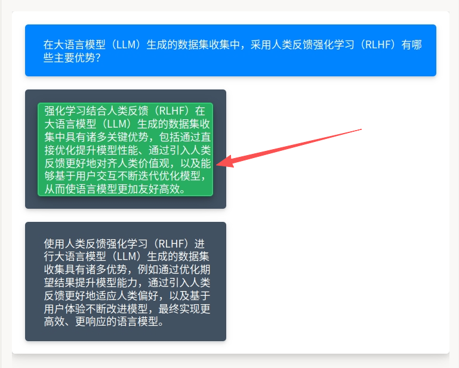
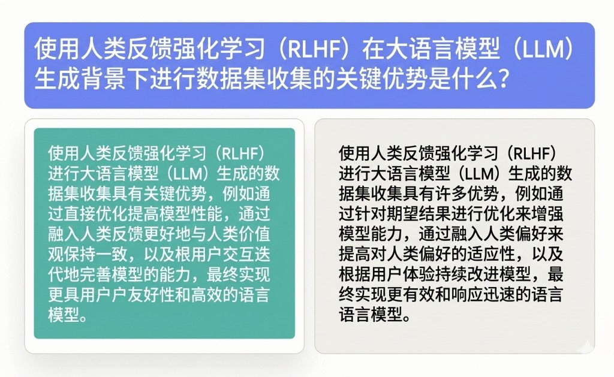

# 人类偏好收集使用说明

可以理解为「上面是共同的问题或指令，下面是两条不同回答，点选你认为更好、更合适或更符合规范的一条」。同一提示下对比可减少位置偏差带来的先验；导出结果通常可映射为「胜 / 负」或偏好分数。它适合 RLHF 数据管线、对话质量排序与安全偏好标注。

## 标注核心作用

1.  成对比较同一 `prompt` 下的 `answer1` 与 `answer2`，直接服务偏好学习与奖励建模；
2.  `Pairwise` 的 `selectionStyle` 高亮被选侧，降低误触与漏选；
3.  布局与样式与监督式提示模版风格统一，便于在同一项目中混排任务类型。

## 基础操作步骤

1.  完整阅读蓝色提示区中的问题或指令；
2.  依次阅读左右两个答案框中的全文，并按项目规范比较事实性、完整性、安全与风格；
3.  点击更优答案所在区域完成选择（选中后会出现绿色高亮等样式，以实际渲染为准）。



说明：截图中的箭头为操作示意；实际排版可能为左右并排或随容器宽度换行，与 `flex-wrap` 行为一致。

## 注意事项

- 两条答案的展示顺序是否随机、是否需做位置平衡，应在数据准备阶段约定；
- `toName="answer1,answer2"` 须与下方两个 `Text` 的 `name` 一致，否则无法建立配对关系；
- 评判标准（谁更「好」）必须文档化，避免不同标注员标准漂移；
- 长文本注意换行与可读性，必要时在 CSS 中调整 `flex-basis` 或字号。

## 模板预览



## 模板配置
### 完整代码块

```html
<View className="root">
      <View className="container">
      <View className="prompt">
        <Text name="prompt" value="$prompt" />
      </View>
      <View className="answers">
        <Pairwise name="comparison" toName="answer1,answer2"
                  selectionStyle="background-color: #27ae60; box-shadow: 0 4px 8px 0 rgba(0, 0, 0, 0.2), 0 6px 20px 0 rgba(0, 0, 0, 0.2); border: 2px solid #2ecc71; cursor: pointer; transition: all 0.3s ease;" />
        <View className="answer-box">
          <Text name="answer1" value="$answer1" />
        </View>
        <View className="answer-box">
          <Text name="answer2" value="$answer2" />
        </View>
      </View>
    </View>
</View>
```

### 配置代码说明

以上代码在卡片内展示提示与两个候选答案，并通过 `Pairwise` 收集点击偏好。

1、样式：`root` / `container` 控制页边与卡片阴影；`prompt` 为只读问题区；`answers` 使用 flex 并排展示；`answer-box` 为单个候选容器。

2、提示：`Text name="prompt" value="$prompt"` 读取任务中的提示字段。

3、成对比较：`Pairwise name="comparison" toName="answer1,answer2"` 将两个命名的 `Text` 区域组成一对可选项；`selectionStyle` 为选中态的内联样式字符串。

4、候选答案：两个 `View className="answer-box"` 内分别放置 `answer1`、`answer2`，内容来自 `$answer1`、`$answer2`。

### 示例数据（简要）

```json
{
  "data": {
    "prompt": "在大语言模型（LLM）生成的数据集收集中，采用人类反馈强化学习（RLHF）有哪些主要优势？",
    "answer1": "强化学习结合人类反馈（RLHF）在大语言模型（LLM）生成的数据集收集中具有诸多关键优势，包括通过直接优化提升模型性能、通过引入人类反馈更好地对齐人类价值观，以及能够基于用户交互不断迭代优化模型，从而使语言模型更加友好高效。",
    "answer2": "使用人类反馈强化学习（RLHF）进行大语言模型（LLM）生成的数据集收集具有诸多优势，例如通过优化期望结果提升模型能力，通过引入人类反馈更好地适应人类偏好，以及基于用户体验不断改进模型，最终实现更高效、更响应的语言模型。"
  }
}
```

说明
- 代码可直接复制到标注配置文件中使用；
- 若平台对 `Pairwise` 与 `Text` 的 DOM 顺序有要求，请以官方文档为准并必要时调整节点顺序；
- 扩展为三路以上比较时，需改用支持多候选的组件或拆分为多任务。