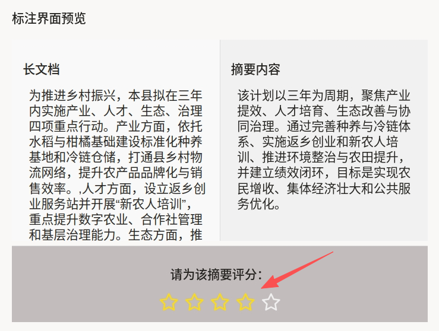
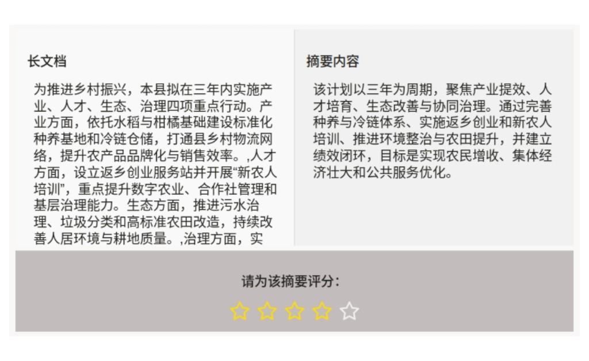

# 大语言模型响应评分使用说明

可以理解为「读长文档，然后看模型写的摘要，最后给摘要打分」。例如乡村振兴类材料，需判断摘要是否覆盖产业、人才、生态、治理等要点且无明显捏造。它适合长文摘要、新闻缩写、报告凝练等**源文—输出对照**型评测。

## 标注核心作用

1.  同屏对照降低来回滚动与窗口切换成本；
2.  `Rating` 绑定到 `summary` 对象，导出时可将分数与摘要区域关联；
3.  分栏高度与滚动区域可控，便于统一截图与质检口径。

## 基础操作步骤

1.  在左侧「长文档」中完整阅读（可上下滚动）；
2.  在右侧「摘要内容」中阅读模型生成结果；
3.  依据项目量表在「请为该摘要评分」处选择星级。



说明：截图中箭头指向星级控件，为操作示意。

## 注意事项

- 若 `Text` 的 `value="$document"` 不支持字符串数组，请将 `document` 改为**单一字符串**（段落间用换行拼接）或按平台文档使用支持的复合类型；
- `Rating` 未显式写 `maxRating` 时，默认星数以实现为准；需固定为 5 级时可补充 `maxRating="5"`；
- 左右栏 `max-height` / `scrollable` 可按篇幅调整，避免长文档显示过短；
- 评分锚点（何为一星、何为五星）须在标注指南中写清。

## 模板预览



## 模板配置
### 完整代码块

```html
<View>
  <View className="root">
    <View className="container">
      <View className="block long-document scrollable">
        <Header value="长文档"/>
        <Text name="document" value="$document"/>
      </View>

      <View className="block short-summary">
        <Header value="摘要内容"/>
        <Text name="summary" value="$summary"/>
      </View>
    </View>

    <View className="summary-rating">
      <Header value="请为该摘要评分："/>
      <Rating name="rating" toName="summary" required="true"/>
    </View>
  </View>
</View>
```

### 配置代码说明

以上代码为「双栏正文 + 底栏评分」布局。

1、样式：`root` 纵向 flex；`container` 承载左右两栏；`long-document` 与 `short-summary` 区分背景与滚动行为；`summary-rating` 为底栏评分条。

2、长文档：左侧 `Text name="document" value="$document"`，配合 `scrollable` 限制高度并纵向滚动。

3、摘要：右侧 `Text name="summary" value="$summary"`，同样可滚动。

4、评分：`Rating name="rating" toName="summary" required="true"` 将星级绑定到摘要对象并设为必填。

### 示例数据（简要）

下列 `document` 为**字符串数组**（三段）；若导入报错，可改为单个字符串。

说明
- 代码可直接复制到标注配置文件中使用；
- 字段名 `document` / `summary` 变更时须同步修改 `value="$..."`；
- 需要 Likert 文案或分段标签时，可在 `Rating` 旁增加说明 `Header` 或改用 `Choices`。