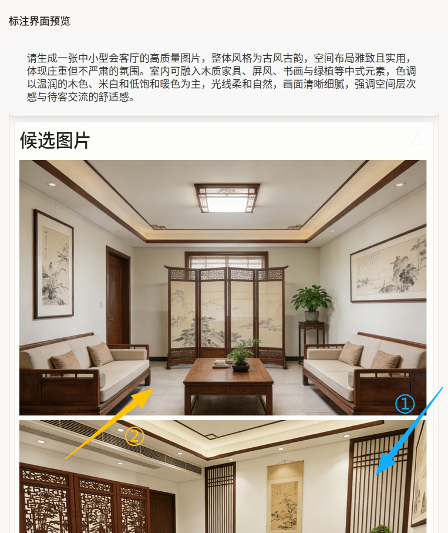
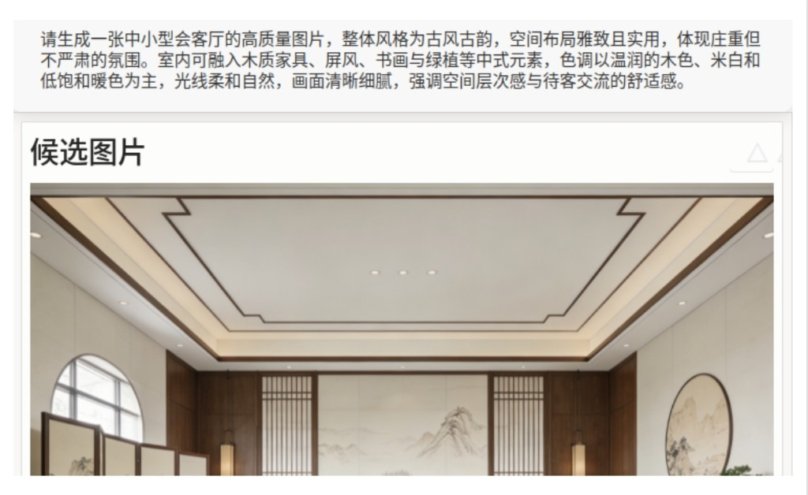

# 视觉排序器使用说明

可以理解为「先读提示词里对画面风格、构图和细节的要求，再在『候选图片』里通过拖拽把更符合提示的图排到更前」。例如古风会客厅场景中，构图完整、光线与家具符合描述的样本应排在前列。它适合文生图模型对比评测、A/B 集构建与多候选排序标注。

## 标注核心作用

1.  同一任务聚合多张候选图，减少反复切换样本的开销；
2.  排序结果可直接反映相对偏好，便于训练排序头或构造 pairwise 数据；
3.  提示与图片分区展示，任务目标一目了然。

## 基础操作步骤

1.  阅读灰色提示面板中的完整生成指令；
2.  在「候选图片」区域浏览每张图篇，并按项目约定（相关性、美感、细节还原等）拖拽调整顺序；
3.  完成排序后默认保存，确认顺序后提交即可。



说明：截图中①②与箭头为教学叠加；实际界面以部署版本为准。

## 注意事项

- `images` 数组中每条使用 `html` 字段嵌入 `` 时，请确保 `src` 指向可访问的静态资源或任务附件 URL；
- `.htx-ranker-item [class^=itemLine]:last-child { display: none }` 用于隐藏列表辅助行，若图片不显示请检查选择器是否与当前 DOM 一致；
- 本示例 `Ranker` 未配置 `Bucket`，适用于**单一有序列表**；若需多分栏（如「合格 / 不合格」），可参考 [大语言模型排序器](./llm-ranker/) 中的 `Bucket` 写法并改造；
- `id` 字段便于在导出结果中与模型版本或随机种子对齐。

## 模板预览



## 模板配置
### 完整代码块

```html
<View>
  <View className="product-panel">
    <Text name="prompt" value="$prompt"/>
  </View>
  <View>
    <List name="generated_images" value="$images" title="候选图片" />
    <Ranker name="rank" toName="generated_images">
    </Ranker>
  </View>
</View>
```

### 配置代码说明

以上代码由提示条、候选列表与排序器组成。

1、提示区：`product-panel` 样式容器内使用 `Text` 绑定 `$prompt`，展示文生图指令。

2、列表：`List name="generated_images" value="$images" title="候选图片"` 将数据中的图片条目渲染为可排序项；`name` 供 `Ranker` 引用。

3、排序：`Ranker name="rank" toName="generated_images"` 对列表项进行拖拽排序；子节点可按需增加 `Bucket` 以实现分桶。

4、样式：`.htx-ranker-item` 去掉多余内边距与边框，并让 `img` 宽度铺满卡片，适合纯图排序场景。

### 示例数据（简要）

以下路径为文档站静态资源示例，导入时请替换为实际可访问的图片地址。

```json
{
  "data": {
    "prompt": "请生成一张中小型会客厅的高质量图片，整体风格为古风古韵，空间布局雅致且实用，体现庄重但不严肃的氛围。室内可融入木质家具、屏风、书画与绿植等中式元素，色调以温润的木色、米白和低饱和暖色为主，光线柔和自然，画面清晰细腻，强调空间层次感与待客交流的舒适感。",
    "images": [
      {
        "id": "chair_1",
        "html": ""
      },
      {
        "id": "chair_2",
        "html": ""
      },
      {
        "id": "chair_3",
        "html": ""
      },
      {
        "id": "chair_4",
        "html": ""
      }
    ]
  }
}
```

说明
- 代码可直接复制到标注配置文件中使用；
- 若 `List` 要求其它字段名（如 `image` URL 而非 `html`），请按平台文档调整数据与模版；
- 大图任务建议控制单任务图片数量与分辨率，避免前端卡顿。