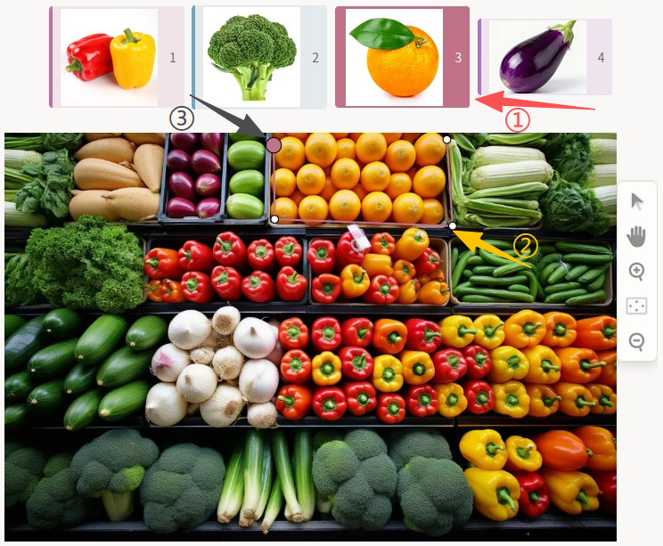
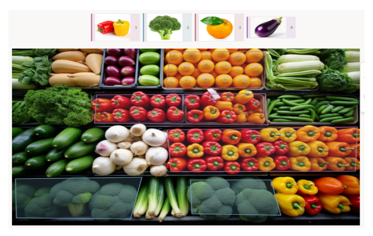

# 库存跟踪使用说明

库存跟踪可以理解为“先选品类，再沿边缘把商品区域圈出来”：在货架图像中选择对应对象类别后，用多边形逐点圈定商品或物料区域，输出可用于库存统计与位置追踪的结构化标注结果。它适合商品密集、遮挡较多、摆放不规则的场景，常用于零售货架盘点、仓储库存管理、陈列监测与补货分析等任务。与基于多边形的语义分割相比，库存跟踪更强调按业务对象做数量与位置追踪，而不是仅做语义区域划分。

## 标注核心作用

1.  提供可追踪的库存数据：通过目标区域与类别信息结合，形成可用于库存统计与变化追踪的数据基础；
2.  适配复杂货架场景：多边形标注可更贴合不规则商品外形，减少背景干扰；
3.  支持动态类别扩展：类别可通过数据字段动态传入，便于不同业务场景复用同一模板。

## 基础操作步骤

1.  在顶部对象区确认或选择目标类别；
2.  在图像中沿目标商品边缘依次点击关键点，绘制多边形；
3.  闭合多边形后完成一个目标标注，继续处理其他商品区域。



说明：可使用右侧工具栏放大或缩小图片，提升密集货架区域的标注准确性。

## 注意事项

- 多边形关键点应尽量贴合商品可见边缘，避免过度包含相邻商品；
- 被遮挡商品按可见区域标注，并保持同一批次标注口径一致；
- 类别名称应与业务侧库存体系保持一致，避免同义词混用造成统计偏差。

## 模板预览



## 模板配置
### 完整代码块

```html
<View>
  <View style="display:flex;justify-content:center">
    <PolygonLabels name="objects" toName="image" value="$objects"/>
  </View>
  <Image name="image" value="$image_path" zoom="true"/>
</View>
```

### 库存跟踪标注配置代码说明

以下代码用于实现库存跟踪场景下的多边形标注功能，可直接复制使用，关键参数可按业务需求调整。

1、对象标签组件：`PolygonLabels` 用于定义可标注对象集合，并通过 `toName="image"` 关联图片组件。

```html
<PolygonLabels name="objects" toName="image" value="$objects"/>
```

2、动态类别来源：`value="$objects"` 表示标签集合由数据字段动态提供，适合不同任务下按需切换对象类别。

3、图片组件：`Image` 负责加载待标注图片，`zoom="true"` 支持放缩查看细节。

```html
<Image name="image" value="$image_path" zoom="true"/>
```

说明
- 代码可直接复制到标注配置文件中使用；
- 若对象类别由后端动态下发，保持 `value="$objects"` 即可；
- 若需固定标签集合，可改为在 `PolygonLabels` 内部显式定义标签项。
