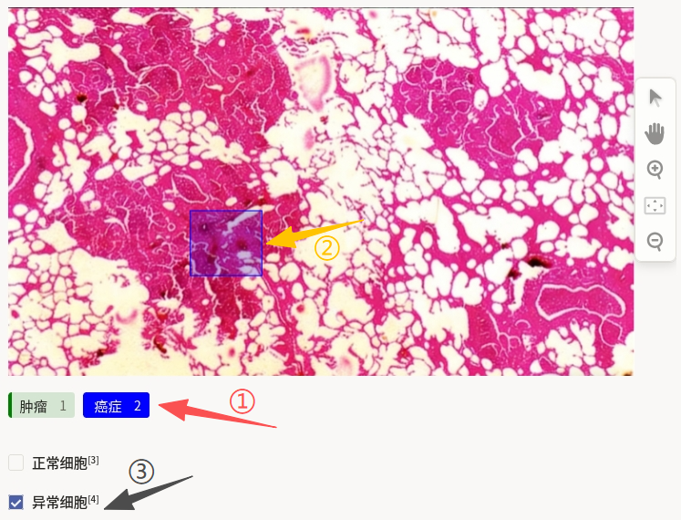
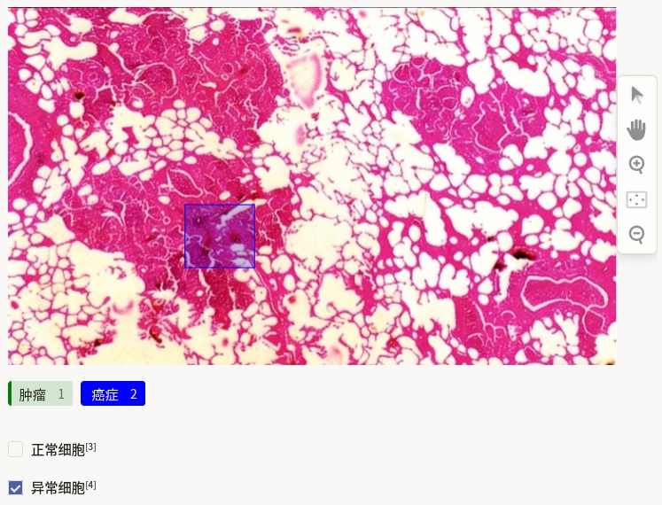

# 带边框的医学图像分类使用说明

带边框的医学图像分类可以理解为“先框病灶区域，再给整张图做分类”：在图像中用矩形框标出重点病灶，再选择整图分类标签（如正常细胞/异常细胞），输出同时包含局部位置和整体判断的标注结果。它适合病理切片、细胞筛查、医学影像异常识别等场景。与目标检测相比，该任务除框选病灶外，还强调对整张图给出统一分类结论。

## 标注核心作用

1.  同时提供局部与全局信息：病灶框用于定位可疑区域，整图分类用于输出样本级结论；
2.  适配医学筛查流程：便于构建“区域提示 + 分类判断”的训练数据；
3.  提升数据可用性：同一份标注数据可支持检测与分类等多类下游任务。

## 基础操作步骤

1.  在标签栏选择病灶类别，如“肿瘤”或“癌症”；
2.  在图片中框选对应区域；
3. 在分类区选择整图类别，如“正常细胞”或“异常细胞”。



说明：可使用右侧工具栏放大图像后再框选，避免遗漏微小病灶区域。

## 注意事项

- 病灶框尽量覆盖主要病变区域，避免包含过多无关背景；
- 整图分类标准需统一，确保“正常/异常”判定口径一致；
- 若一张图存在多个病灶，可分别框选，但整图分类仍需给出单一明确结论。

## 模板预览



## 模板配置
### 完整代码块

```html
<View>
  <Image name="image" value="$image_path" zoom="true"/>

  <RectangleLabels name="label" toName="image">
    <Label value="肿瘤" background="green"/>
    <Label value="癌症" background="blue"/>
  </RectangleLabels>

  <Choices name="classification" toName="image">
    <Choice value="正常细胞"/>
    <Choice value="异常细胞"/>
  </Choices>
</View>
```

### 带边框的医学图像分类配置代码说明

以下代码用于实现“局部框选 + 整图分类”的复合标注功能，可直接复制使用。

1、图片加载组件：用于加载待标注医学图像，`zoom="true"` 表示支持图像缩放。

```html
<Image name="image" value="$image_path" zoom="true"/>
```

2、病灶框选组件：`RectangleLabels` 用于定义病灶类别并在图中框选目标区域。

```html
<RectangleLabels name="label" toName="image">
  <Label value="肿瘤" background="green"/>
  <Label value="癌症" background="blue"/>
</RectangleLabels>
```

3、整图分类组件：`Choices` 用于给整张图像选择分类标签。

```html
<Choices name="classification" toName="image">
  <Choice value="正常细胞"/>
  <Choice value="异常细胞"/>
</Choices>
```

说明
- 代码可直接复制到标注配置文件中使用；
- 可按业务需要增删 `Label` 与 `Choice` 项；
- 建议先完成病灶框选，再进行整图分类，便于复核一致性。
