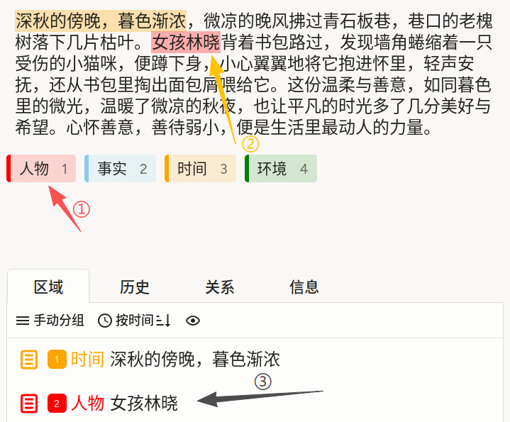
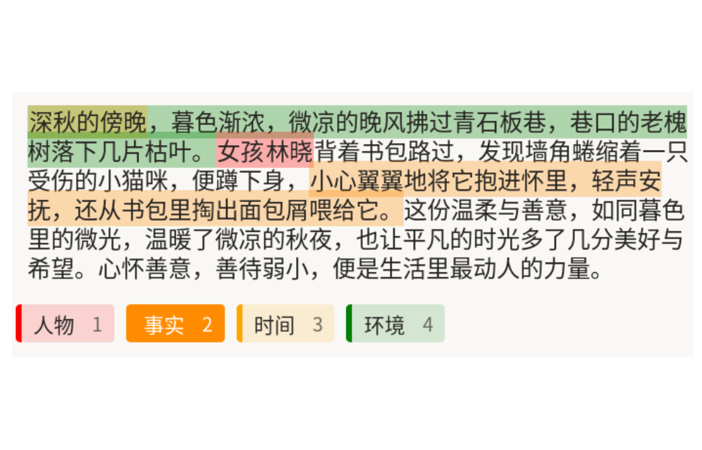

# 命名实体识别使用说明

命名实体识别可以理解为「先选实体类别，再在原文中圈出对应片段」：例如先点选“人物”，再在文本里拖选“女孩林晓”；切换到“时间”后再标注“深秋的傍晚”。它适合新闻、合同、医疗记录、客服对话等文本场景，常用于实体抽取、关系抽取和知识图谱构建任务。

## 标注核心作用

1.  将非结构化文本转成结构化实体数据，便于检索和统计；
2.  支持多类别并行标注，提升信息抽取覆盖度；
3.  通过统一标签口径，降低模型训练时的语义噪声。

## 基础操作步骤

1.  通读文本，识别其中的人物、事实、时间、环境等关键信息；
2.  点选下方实体标签（如“人物”）；
3.  在文本中拖选对应片段完成标注；
4.  重复以上步骤，直到主要实体标注完成。



说明：建议按“人物 -> 事实 -> 时间 -> 环境”的顺序标注，完成后在下方历史区复核，避免漏标或类别选错。

## 注意事项

- 实体边界尽量紧凑，避免把上下文虚词一并选入；
- 同一类型实体在整批任务中保持统一口径（如时间是否包含修饰词）；
- 若同一片段可能落入多个类别，优先按项目标注规范处理，避免重复冲突。

## 模板预览



## 模板配置
### 完整代码块

```html
<View>
  <Text name="text" value="$text"/>
  <Labels name="label" toName="text">
    <Label value="人物" background="red"/>
    <Label value="事实" background="skyblue"/>
    <Label value="时间" background="orange"/>
    <Label value="环境" background="green"/>
  </Labels>
</View>
```

### 命名实体识别配置代码说明

以上代码用于实现“文本片段划选 + 实体类别打标”的基础 NER 流程。

1、文本组件：`Text name="text" value="$text"` 用于加载待标注正文。

2、标签组件：`Labels name="label" toName="text"` 将实体标签绑定到文本对象；每次先选标签，再在文本中划选片段，即可生成一条实体标注结果。

3、标签类别：示例包含“人物、事实、时间、环境”四类，可按业务扩展为“组织、地点、金额、产品名”等。

### 示例数据（简要）

以下示例与截图语义一致，`text` 建议保持单行字符串，便于导出后做偏移校验。

```json
{
  "data": {
    "text": "深秋的傍晚，暮色渐浓，微凉的晚风拂过青石板巷。女孩林晓背着书包路过，发现墙角蜷缩着一只受伤的小猫咪，便蹲下身，小心翼翼地将它抱进怀里，轻声安抚，还从书包里掏出面包屑喂给它。"
  }
}
```

说明
- 代码可直接复制到标注配置文件中使用；
- 新增或修改 `Label` 后，建议同步更新质检规则和标注员说明；
- 如需限制某类实体数量，可在项目规则层面补充约束策略。
