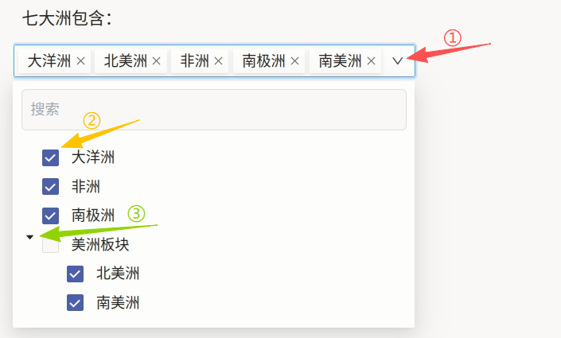
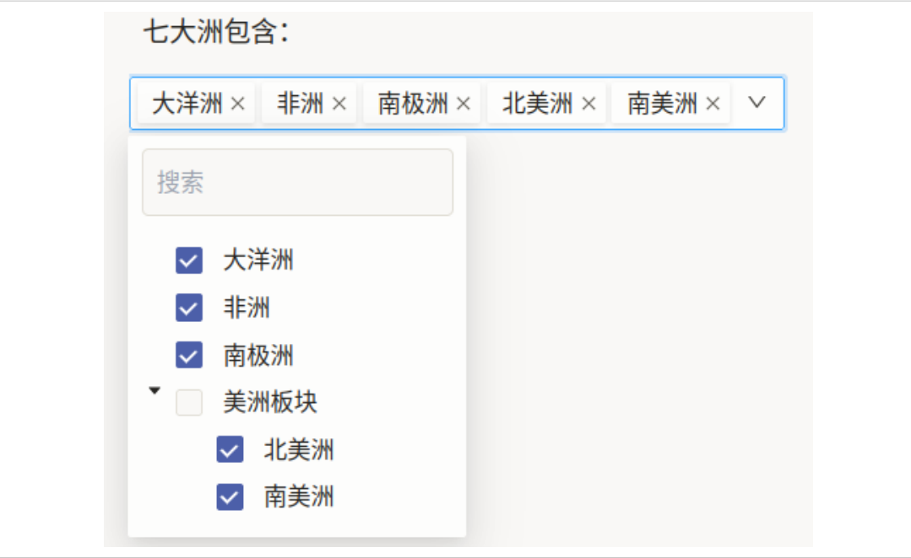

# 分类体系使用说明

分类体系可以理解为“选择最符合文本的标签”：先阅读文本，再从树形选项中选择最匹配的分类节点。与普通单层分类不同，Taxonomy 能表达“父类 -> 子类”的层级关系，例如先是“美洲板块”，再细分到“北美洲/南美洲”。

## 标注核心作用

1.  支持层级标签表达：不仅知道“属于哪类”，还能表示“属于该类下的哪一支”；
2.  提升分类一致性：统一树形体系后，跨团队标注口径更稳定；
3.  便于后续检索统计：可按父类聚合，也可按叶子节点细分分析。

## 基础操作步骤

1.  阅读题目内容，点击右侧下拉箭头展开分类树；
2.  在列表中选择目标节点；若为父子结构，可按需展开后选子类；
3.  提交前核对已选标签是否完整、是否存在误选。



说明：示例中“美洲板块”下含“北美洲/南美洲”子项；若业务要求更细粒度（如国家、地区），可继续向下扩展 `Choice` 层级。

## 注意事项

- 父子节点命名应避免语义重叠，减少“该选父类还是子类”的歧义；
- 若项目只允许最末级节点生效，需在标注规范中明确“禁止只选父类”；
- 调整树结构后，建议同步更新历史数据映射与质检规则。

## 模板预览



## 模板配置
### 完整代码块

```html
<View>
  <Text name="text" value="$text"/>
  <Taxonomy name="taxonomy" toName="text">
    <Choice value="大洋洲" />
    <Choice value="非洲" />
    <Choice value="南极洲" />
    <Choice value="美洲板块">
      <Choice value="北美洲" />
      <Choice value="南美洲" />
    </Choice>
  </Taxonomy>
</View>
```

### 分类体系配置代码说明

以上代码用于实现“文本 + 树形分类标签”的标注流程。

1、文本组件：`Text name="text" value="$text"` 用于显示待分类文本内容。

2、分类组件：`Taxonomy name="taxonomy" toName="text"` 定义层级标签树，并绑定到文本对象。

3、层级定义：每个 `Choice` 为一个分类节点；在某个 `Choice` 内继续嵌套 `Choice`，即可构建子分类（如“美洲板块 -> 北美洲/南美洲”）。


说明
- 代码可直接复制到标注配置文件中使用；
- 可按业务把“洲 -> 国家 -> 城市”或“主题 -> 子主题”逐级扩展；
- 若需限制可选深度或节点数量，可在项目规则层面补充约束。
