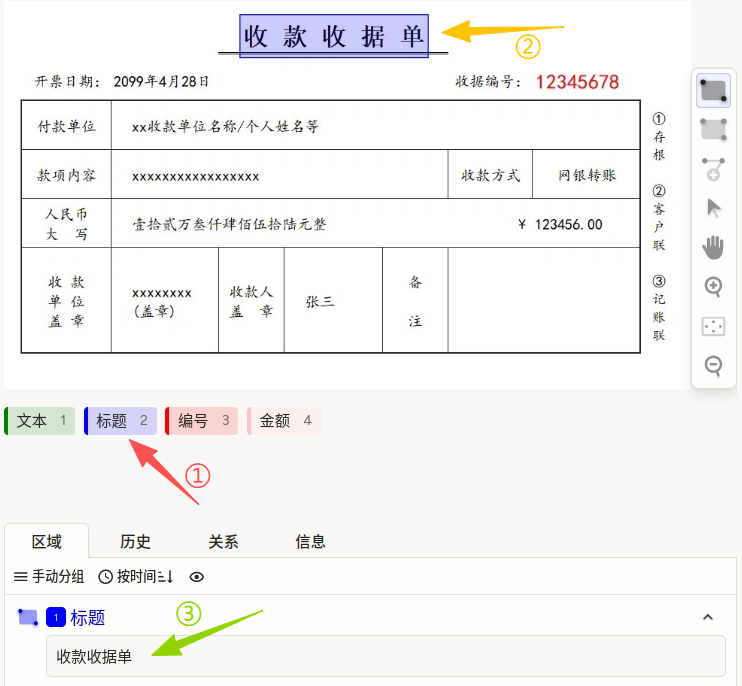
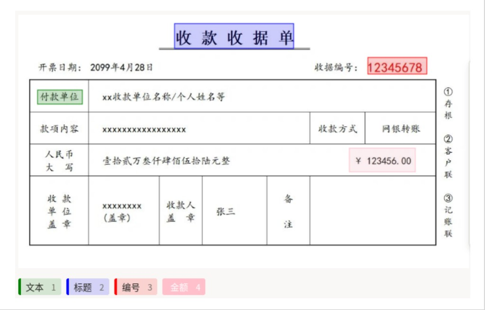

# 光学字符识别使用说明

光学字符识别可以理解为“先标出文字区域，再填写识别文本”：在图片中用矩形或多边形圈定文字位置，给区域选择标签（如文本、标题、编号、金额），并为每个区域录入对应文字内容。它适合票据、合同、报告、表单等场景，常用于文字检测、文本识别与关键信息抽取任务。

## 标注核心作用

1.  同时提供定位与转写数据：区域标注用于文本定位，转写结果用于识别训练；
2.  适配复杂版式文档：支持矩形与多边形两种区域形状，便于处理倾斜或不规则文本；
3.  支持字段化管理：通过标签区分不同文本类型，提升后续抽取与质检效率。

## 基础操作步骤

1.  选择标签类型，如“文本”“标题”“编号”“金额”；
2.  在图中使用矩形或多边形标出文字区域；
3.  在对应区域输入识别文本并提交。



说明：建议先完成区域标注，再统一填写转写文本，减少漏标和错配。

## 注意事项

- 标注区域尽量贴合文字边界，避免包含相邻无关内容；
- 转写文本需与原文一致，保留必要符号与格式（如编号、金额小数点）；
- 对难辨识文字可按项目规范记录，不要随意猜测。

## 模板预览



## 模板配置
### 完整代码块

```html
<View>
  <Image name="image" value="$image_path"/>

  <Labels name="label" toName="image">
    <Label value="文本" background="green"/>
    <Label value="标题" background="blue"/>
    <Label value="编号" background="red"/>
    <Label value="金额" background="pink"/>
  </Labels>

  <Rectangle name="bbox" toName="image" strokeWidth="3"/>
  <Polygon name="poly" toName="image" strokeWidth="3"/>

  <TextArea name="transcription" toName="image"
            editable="true"
            perRegion="true"
            required="true"
            maxSubmissions="1"
            rows="5"
            placeholder="Recognized Text"
            displayMode="region-list"
            />
</View>
```

### 光学字符识别配置代码说明

以下代码用于实现 OCR 场景下的“区域定位 + 文本转写”联合标注。

1、标签组件：`Labels` 用于定义文本类型标签（文本、标题、编号、金额）。

2、区域标注组件：`Rectangle` 与 `Polygon` 同时启用，可按文本形状选择更合适的标注方式。

```html
<Rectangle name="bbox" toName="image" strokeWidth="3"/>
<Polygon name="poly" toName="image" strokeWidth="3"/>
```

3、转写组件：`TextArea` 用于为每个标注区域录入识别文本，是 OCR 训练数据中的核心内容。推荐与区域标注配合使用，先框选后转写，保证“区域-文本”一一对应。

```html
<TextArea name="transcription" toName="image"
          editable="true"
          perRegion="true"
          required="true"
          maxSubmissions="1"
          rows="5"
          placeholder="Recognized Text"
          displayMode="region-list"
          />
```

参数说明：
- `name="transcription"`：定义转写字段名称，用于保存该区域的识别文本；
- `toName="image"`：将转写结果绑定到图片标注对象；
- `editable="true"`：允许标注人员在界面中直接编辑文本内容；
- `perRegion="true"`：每个标注区域都对应一个独立的转写输入框，适合逐框录入；
- `required="true"`：该字段必填，未填写时无法提交，有助于避免漏标；
- `maxSubmissions="1"`：每个区域最多提交一条转写结果，避免重复录入；
- `rows="5"`：输入框默认显示 5 行，便于录入较长文本；
- `placeholder="Recognized Text"`：输入框提示语，可按项目语言习惯调整；
- `displayMode="region-list"`：以区域列表形式展示转写任务，便于批量核对。

使用建议：
- 若文本较长或分行明显，建议按视觉阅读顺序完整录入，避免截断；
- 金额、编号等字段建议保持原始格式（如小数点、连字符）；
- 质检时优先检查“框选区域是否正确”与“转写内容是否匹配原文”。

说明
- 代码可直接复制到标注配置文件中使用；
- 若仅需一种区域形状，可只保留 `Rectangle` 或 `Polygon`；
- 建议在质检阶段重点核对“区域与转写内容是否一一对应”。
