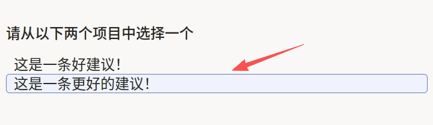
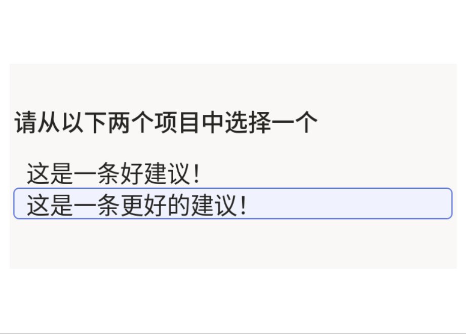

# 成对分类使用说明

成对分类可以理解为「给你两个候选，只选更优那个」：界面同时展示两条待比较内容，标注员基于统一标准做二选一判断。它适合答案偏好学习、文案 A/B 对比、模型输出优劣评估等场景。

## 标注核心作用

1.  构建“成对偏好”监督信号，支撑排序与偏好模型训练；
2.  将主观质量判断结构化，便于后续统计和回放分析；
3.  相比绝对打分更稳定，适合快速批量标注。

## 基础操作步骤

1.  阅读两条候选文本，按任务标准比较质量；
2.  在界面中选择更优的一项。



说明：若两项质量接近，优先依据项目既定规则（如事实准确性、完整性、可读性）做出稳定选择。

## 注意事项

- 两条候选应保持可比性（同任务、同维度）；
- 标注前建议先统一“更优”的判断标准，降低主观漂移；
- 若业务需要“可平局”机制，需在模板层增加第三种选择。

## 模板预览



## 模板配置
### 完整代码块

```html
<View>
  <Header>请从以下两个项目中选择一个</Header>
  <Pairwise name="pw" toName="text1,text2" />
  <Text name="text1" value="$pairText1" />
  <Text name="text2" value="$pairText2" />
</View>
```

### 配置说明

以上代码用于实现“两条候选文本的二选一偏好判断”。

1、比较组件：`Pairwise` 在 `text1` 与 `text2` 间建立成对选择关系。  
2、目标绑定：`toName="text1,text2"` 指定比较对象为两条文本。  
3、候选内容：两个 `Text` 分别承载 `$pairText1` 与 `$pairText2`。

### 示例数据

```json
{
  "data": {
    "pairText1": "这是一条好建议！",
    "pairText2": "这是一条更好的建议！"
  }
}
```

说明
- 代码可直接复制到标注配置文件中使用；
- 两条文本建议保持可比性（同任务、同维度）；
- 若要扩展为多轮对比，通常按多条样本批量提交，而不是在单条任务里堆叠过多字段。

