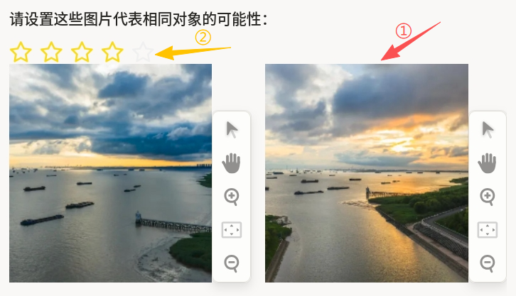
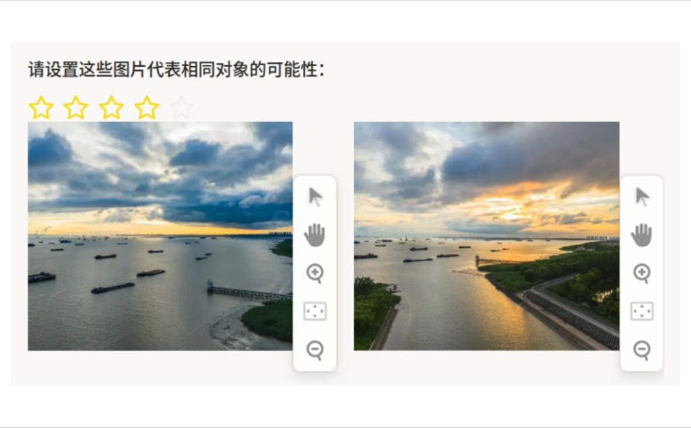

# 成对回归使用说明

成对回归可以理解为「看两张图，给一个相似度分数」：它不是二选一，而是用连续评分表达“两张图代表同一对象的可能性”。该模板适合图像相似度学习、检索重排打分、视觉质量评测等任务。

## 标注核心作用

1.  提供连续监督信号，支持细粒度相似度建模；
2.  兼顾“是否相似”与“相似程度”两层信息；
3.  可作为检索排序或匹配模型的高质量训练样本。

## 基础操作步骤

1.  对比两张图片的主体、场景、构图和关键细节；
2.  使用评分组件给出“同一对象可能性”分值；
3.  提交前确认评分与任务标准一致。



说明：建议先制定统一评分口径（如 1~5 每档含义），再开展批量标注，减少个体偏差。

## 注意事项

- 评分应重点关注任务定义的“同一对象”标准，而非单纯视觉好看与否；
- 相似但非同一对象的样本应给中低分，避免误导模型；
- 数据集若包含风格差异较大的图像，建议加强标注前校准。

## 模板预览



## 模板配置
### 完整代码块

```html
<View>
  <Header>请设置这些图片代表相同对象的可能性：</Header>
  <Rating name="rating" toName="image1,image2"/>
  <View style="display: flex; gap: 16px; align-items: flex-start;">
    <Image name="image1" value="$image1" />
    <Image name="image2" value="$image2" />
  </View>
</View>
```

### 配置说明

以上代码用于实现“两张图像的相似度连续评分”。

1、评分组件：`Rating name="rating"` 用于输出分值。  
2、目标绑定：`toName="image1,image2"` 表示评分对象为两张图的配对关系。  
3、图像展示：并排展示 `image1` 与 `image2`，便于直接对照判断。

说明
- 代码可直接复制到标注配置文件中使用；
- 评分等级可按任务需要在平台中配置；
- 建议先统一评分标准（如 1~5 各代表什么）再开展批量标注。

