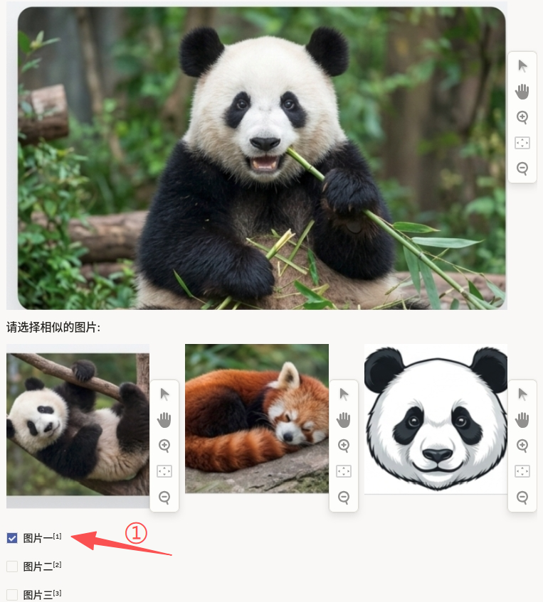
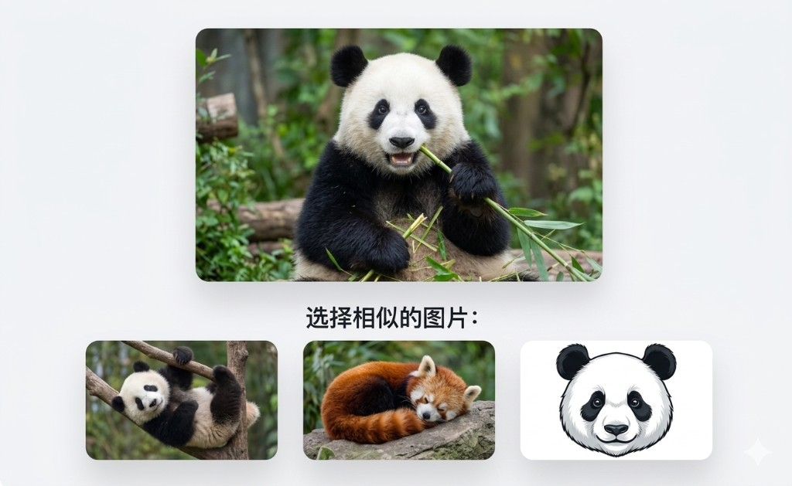

# 基于内容图像检索使用说明

基于内容图像检索可以理解为「看查询图，再从候选里挑出像它的」：上方为 **查询图**（query），下方三张为 **候选图**；勾选「图片一 / 图片二 / 图片三」对应左、中、右三张图是否 **内容相近**。支持 **多选**（`choice="multiple"`），即可以同时认为多张候选与查询相似，也可以只选一张或不选（若项目允许空选，需单独约定；本配置中 `required="true"` 表示必须至少选一项）。

每张图旁通常带有缩放、平移等查看工具，便于放大细节后再判断相似性。

## 标注核心作用

1.  提供「查询–候选」相关性的人工标签，用于训练或评估检索模型；
2.  区分「看起来像」与「语义相关」（如物种、场景、风格），可按项目定义相似口径；
3.  多选支持召回型标注：凡符合标准的候选均可勾选。

## 基础操作步骤

1.  观察查询图的主体、场景、风格与关键细节；
2.  依次查看三张候选图，必要时使用缩放工具；
3.  勾选与查询在既定标准下相似的选项，可多选；
4.  提交前确认勾选与图片位置一一对应。



说明：选项文案「图片一 / 图片二 / 图片三」与左至右三张候选图顺序固定对应。

## 注意事项

- 相似性标准以项目规范为准（如是否要求同物种、同场景、是否排除插画等）；
- 若需改为单选，将 `choice` 改为 `single` 并同步调整质检规则；
- 候选图数量扩展时，需同步增加 `Image` 与 `Choice` 项。

## 模板预览



## 模板配置
### 完整代码块

```html
<View>
  <Image name="query" value="$original_image" />
  <Header value="请选择相似的图片:" />
  <View style="display: grid; column-gap: 8px; grid-template: auto/1fr 1fr 1fr">
    <Image name="image1" value="$image_1" />
    <Image name="image2" value="$image_2" />
    <Image name="image3" value="$image_3" />
  </View>
  <Choices name="similar" toName="query" required="true" choice="multiple">
    <Choice value="图片一" />
    <Choice value="图片二" />
    <Choice value="图片三" />
  </Choices>
  <Style>
    [dataneedsupdate]~div form {display: flex}
    [dataneedsupdate]~div form>* {flex-grow:1;margin-left:8px}
  </Style>
</View>
```

### 基于内容图像检索配置代码说明

1、查询图：`Image name="query" value="$original_image"` 作为检索基准。

2、候选图：三列网格展示 `$image_1`、`$image_2`、`$image_3`，与 `Choice` 文案顺序一致。

3、选择：`Choices name="similar" toName="query"` 将选择与查询图绑定；`choice="multiple"` 允许多选；`required="true"` 要求至少提交一项选择。

4、样式：`Style` 中 `[dataneedsupdate]` 为平台侧占位标记，用于在渲染后调整选项区布局（以实际环境为准）。

### 示例数据（简要）

```json
{
  "data": {
    "original_image": "/static/templates/project-templates-config/ranking-and-scoring/content-based-image-search/image_origin.png",
    "image_1": "/static/templates/project-templates-config/ranking-and-scoring/content-based-image-search/image1.png",
    "image_2": "/static/templates/project-templates-config/ranking-and-scoring/content-based-image-search/image2.png",
    "image_3": "/static/templates/project-templates-config/ranking-and-scoring/content-based-image-search/image3.png"
  }
}
```
说明
- 代码可直接复制到标注配置文件中使用；
- 图片路径可按项目静态资源目录调整；
- 若候选与选项多于三个，复制 `Image` 与 `Choice` 并同步扩展 `grid-template` 列数。
