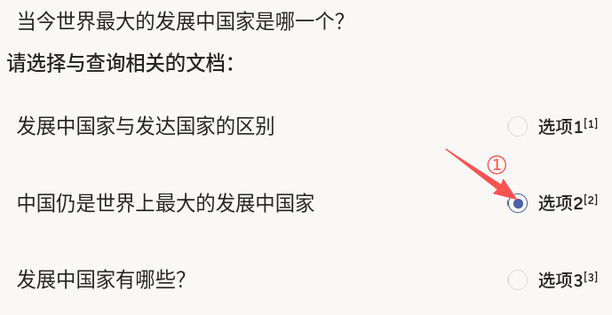
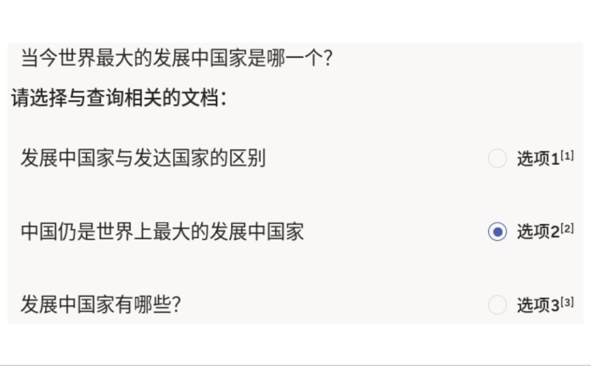

# 文档检索使用说明

文档检索可以理解为「先看查询，再选最相关文档」：上方显示用户查询，下方展示多条候选文本。标注员根据语义匹配程度，在候选中选择与查询最相关的一项。

本模板采用每行一个单选按钮（`choice="single-radio"`）的形式，让标注员在三条候选文档中完成相关性判断。适用于 FAQ 检索、知识库问答召回、搜索排序训练等任务。

## 标注核心作用

1.  构建查询-文档相关性样本，提升检索模型排序质量；
2.  用人工判断纠正词面匹配误差，强化语义匹配能力；
3.  为问答系统提供高质量“命中文档”监督信号。

## 基础操作步骤

1.  阅读查询句，并逐条查看候选文档内容；
2.  在最相关的一条右侧勾选对应选项，可多选；
3.  提交前确认未误选、漏选。



说明：若两条候选都部分相关，优先选择“更直接回答查询”的那一条。

## 注意事项

- 当前配置是“每行一个独立单选组件”，默认可出现多行同时被选；若业务要求“全局只能选一条”，建议改为单个 `Choices` 包含多个 `Choice`；
- 相关性判定以“是否回答查询”优先，不只看关键词重合；
- 若候选数量扩展，需同步新增 `Text` 与对应 `Choices` 区块。

## 模板预览



## 模板配置
### 完整代码块

```html
<View>
  <Text name="query" value="$query" />
  <Header value="请选择与查询相关的文档：" />
  <View style="display:flex; align-items:center; justify-content:space-between; gap:12px; margin:8px 0;">
    <View style="flex:1;">
      <Text name="text1" value="$text1" />
    </View>
    <Choices name="selection_1" toName="query" choice="single-radio" showInline="true">
      <Choice value="选项1" />
    </Choices>
  </View>
  <View style="display:flex; align-items:center; justify-content:space-between; gap:12px; margin:8px 0;">
    <View style="flex:1;">
      <Text name="text2" value="$text2" />
    </View>
    <Choices name="selection_2" toName="query" choice="single-radio" showInline="true">
      <Choice value="选项2" />
    </Choices>
  </View>
  <View style="display:flex; align-items:center; justify-content:space-between; gap:12px; margin:8px 0;">
    <View style="flex:1;">
      <Text name="text3" value="$text3" />
    </View>
    <Choices name="selection_3" toName="query" choice="single-radio" showInline="true">
      <Choice value="选项3" />
    </Choices>
  </View>
</View>
```

### 文档检索配置代码说明

1、查询区：`Text name="query"` 展示待检索问题。

2、候选区：每条候选用一行 `Text + Choices` 布局，右侧单选用于标注“该文档是否命中”。

3、单选方式：`choice="single-radio"` 使单个 `Choices` 组件内为单选；当前三行是三个独立组件，适合“逐项打标”场景。

说明
- 代码可直接复制到标注配置文件中使用；
- 若你希望“严格三选一”，建议改造为一个 `Choices` 容器统一管理三个 `Choice`；
- 候选文档可接入检索系统产出的 TopK 结果做批量标注。

