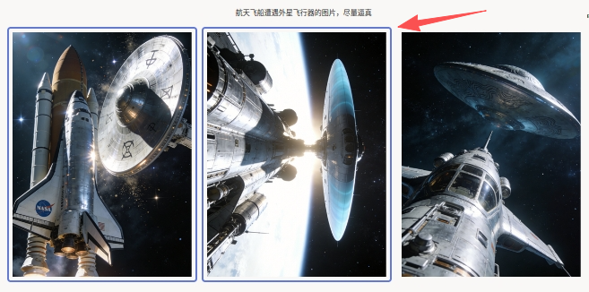
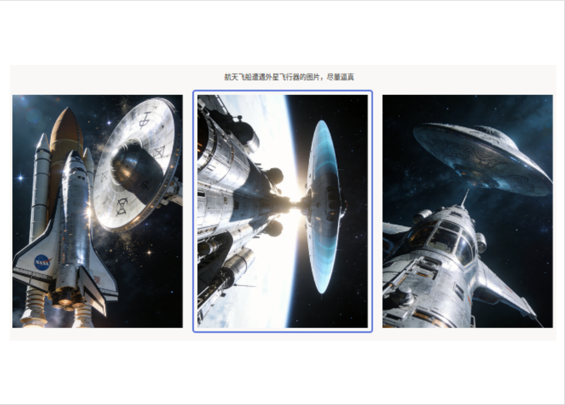

# 文本到图像生成使用说明

文本到图像生成可以理解为「先看提示词，再选匹配图」：界面顶部展示生成提示词，下方展示多张候选图，标注员根据“是否符合提示词语义与细节”勾选一张或多张更匹配的结果。

## 标注核心作用

1.  建立“提示词-图像”对齐监督，提升生成质量评测能力；
2.  支持多选，便于保留多个合格候选；
3.  通过统一视觉标准，沉淀可用于模型迭代的偏好数据。

## 基础操作步骤

1.  阅读提示词，提取主体、场景与风格约束；
2.  对比下方候选图，判断哪些图更符合描述；
3.  勾选符合要求的候选图后提交。



说明：当多张候选都满足提示词时可同时勾选；当存在明显违背提示词要素的图像时不勾选。

## 注意事项

- 勾选依据优先看“语义匹配”，其次看清晰度与美观度；
- 若提示词包含关键约束（如物体、动作、风格），需重点核对；
- `choice="multiple"` 为多选模式，若业务要求单选需改为单选配置。

## 模板预览



## 模板配置
### 完整代码块

```html
<View>
  <View className="ch-title">
    <Text name="prompt" value="$prompt"/>
  </View>
  <View className="highlight">
    <Choices name="images" toName="prompt" value="$images" choice="multiple" layout="inline"/>
  </View>
</View>
```

### 文本到图像生成配置代码说明

1、提示词展示：`Text name="prompt"` 显示生成任务描述。  
2、候选图选择：`Choices name="images"` 通过 `value="$images"` 动态加载图像选项，`layout="inline"` 横向展示，`choice="multiple"` 支持多选。  
3、样式高亮：通过 `Style` 隐藏默认复选框并用边框高亮选中项，提升视觉可读性。

### 示例数据（简要）

```json
{
  "data": {
    "prompt": "航天飞船遭遇外星飞行器的图片，尽量逼真",
    "images": [
      {
        "value": "id123#0",
        "style": "margin: 5px",
        "html": ""
      },
      {
        "value": "id123#1",
        "style": "margin: 5px",
        "html": ""
      },
      {
        "value": "id123#2",
        "style": "margin: 5px",
        "html": ""
      }
    ]
  }
}
```

说明
- 代码可直接复制到标注配置文件中使用；
- `images` 为对象数组，常用字段包括 `value`、`html`、`style`；
- 若候选图数量增加，保持同样数据结构即可。

