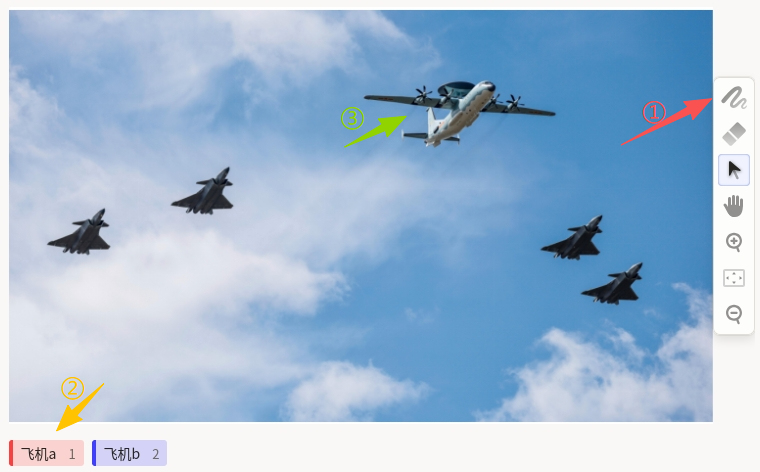
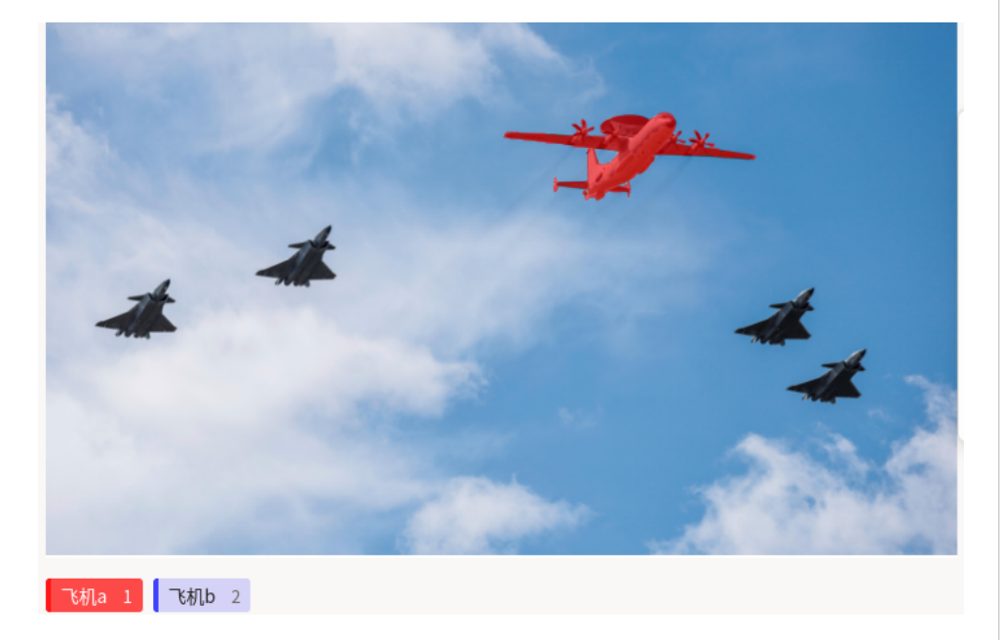

# 带掩码的语义分割使用说明

带掩码的语义分割，核心是通过画笔掩码涂抹的方式，对目标物体进行像素级的覆盖标注，实现精细的语义分割标注。区别于多边形的轮廓式标注，适用于飞机、云朵、植被、医学影像病灶等无清晰轮廓或需要精细纹理标注的目标场景，广泛应用于航空航天影像分析、遥感图像识别、医疗影像诊断等领域。

## 标注核心作用

1.  实现像素级精细标注：通过掩码涂抹精准覆盖目标区域，捕捉纹理细节，区分目标与背景的细微差异，为语义分割模型提供高密度训练数据；
2.  适配无明确轮廓场景：解决多边形标注无法覆盖模糊边缘、复杂纹理目标的问题，提升标注数据的完整性；
3.  支持多目标、多类别标注：可选择不同标签的掩码画笔，分别涂抹标注多个不同类别的目标，每个掩码区域关联对应标签。

## 基础操作步骤

1. 选择画笔，可调节画笔大小
2. 选择不同颜色的标签，以区分不同目标
3. 涂抹图中目标区域



说明：可使用右侧工具栏放大或缩小图片，便于进行精准标注。

## 注意事项

- 涂抹掩码时，尽量贴合目标像素范围，避免遗漏目标区域或过度覆盖背景区域；
- 对于纹理复杂的目标，可调整画笔参数提升标注精细度；
- 不同类别的目标需选择对应标签的掩码画笔，避免标签混淆，影响模型训练效果；
- 标注过程中可随时切换画笔、橡皮擦工具，或撤销已完成的涂抹操作。

## 模板预览



## 模板配置
### 完整代码块

```html
<View>
    <Image name="image" value="$image_path" zoom="true"/>
    <BrushLabels name="tag" toName="image">
      <Label value="飞机a" background="rgba(255, 0, 0, 0.7)"/>
      <Label value="飞机b" background="rgba(0, 0, 255, 0.7)"/>
    </BrushLabels>
</View>
```

### 掩码语义分割标注配置代码说明

以下代码用于实现掩码语义分割标注功能，可直接复制使用，关键部分可根据实际标注需求修改。

1、图片加载组件：加载需要标注的图片，zoom="true" 表示支持图片缩放，无需修改。

```html
<Image name="image" value="$image_path" zoom="true"/>
```

2、掩码标注核心配置

<!--TODO: 以下关键字和标签等，可设计为跳转链接，跳转到本网站的相关内容，例如：[lable]() https://github.com/jujidata/jujidata-docs/issues/9 -->

- BrushLabels 是掩码画笔标注组件，用于定义标签和掩码颜色。
- value 表示标签名称，可自定义修改为需要标注的类别
- background 可以设置掩码颜色，支持 RGBA 格式，最后一位数字代表透明度。透明度 0.7 显示清晰且不遮挡原图，推荐保持默认

```html
<BrushLabels name="tag" toName="image">
  <Label value="飞机a" background="rgba(255, 0, 0, 0.7)"/>
  <Label value="飞机b" background="rgba(0, 0, 255, 0.7)"/>
</BrushLabels>
```

说明
- 代码可直接复制到标注配置文件中使用
- 只需修改标签名称和掩码颜色即可适配不同场景
- 若需增加更多类别，直接复制 label 行并修改内容
