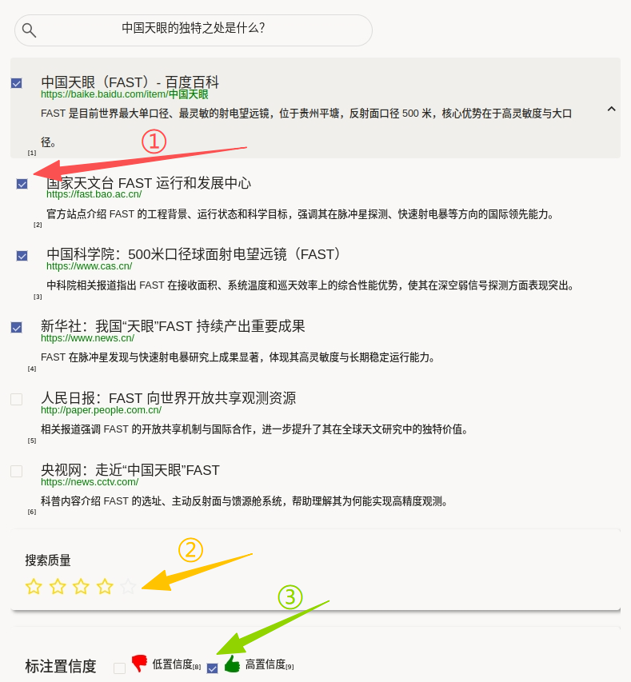
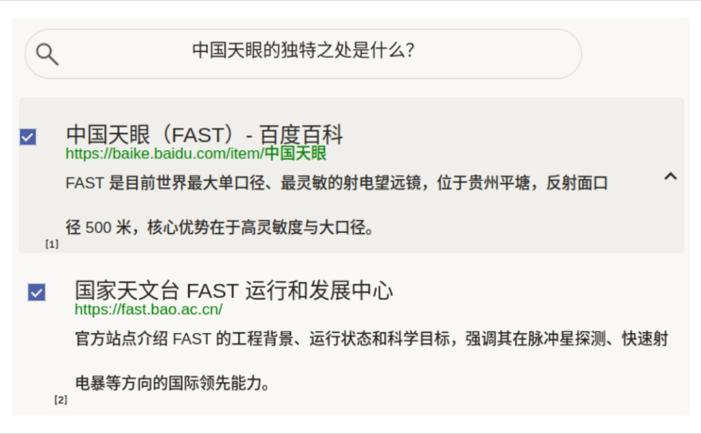

# 搜索页面排序使用说明

搜索页面排序可以理解为“根据搜索判断哪些结果相关、整体质量如何、你有多确定”：上方显示查询词，中间是可多选的搜索结果列表，底部补充搜索质量星级与标注置信度。该模板适用于搜索引擎排序评估、检索模型重排训练与人工质检场景。

## 标注核心作用

1.  结果多选标注：支持一次标记多个相关结果，贴合真实检索场景；
2.  质量信号增强：`Rating` 提供查询级别整体质量分；
3.  置信度补充：低/高置信度可用于后续样本加权与复核分流。

## 基础操作步骤

1.  阅读查询词，明确用户意图；
2.  在结果列表中勾选相关项，支持多选与嵌套项；
3.  对当前搜索结果整体质量进行星级评分；
4.  选择“低/高置信度”并提交。



说明：遇到边界样本时，先按相关性标准打标，再用“低置信度”标记不确定样本，便于二次复核。

## 注意事项

- `selection="checkbox"` 与 `choice="multiple"` 表示结果可多选；
- `allownested="true"` 支持父子结果结构，注意父子项的相关性独立判断；
- `showInLine="true"` 为当前模板写法，如平台仅识别 `showInline`，请按运行环境调整。

## 模板预览



## 模板配置
### 完整代码块

```html
<View>
  <View style="margin:5px;      width:575px;      border-radius:30px;      border:1px solid #dcdcdc;             height:45px;      width:500px;      font-size:16px;             display: flex;             justify-content: center;             padding: 8px;      outline: none;             background-image: url('https://htx-pub.s3.amazonaws.com/samples/google-search-magnifying-glass-icon-5.jpeg');             background-position: left center;             background-size: 24px;             background-repeat: no-repeat;             background-origin: content-box;                ">
    <Text name="text" value="$text"/>
  </View> 
  <View className="dynamic_choices">
    <Choices name="dynamic_choices" toName="text" selection="checkbox" value="$options" layout="vertical" choice="multiple" allownested="true"/>
  </View>
  <View style="box-shadow: 2px 2px 5px #999; padding: 20px; margin-top: 1em; border-radius: 5px;">
    <Header value="搜索质量"/>
    <Rating name="relevance" toName="text"/>
  </View>
  <View style="box-shadow: 2px 2px 5px #999; padding: 15px 5px 10px 20px; margin-top: 1.5em; margin-bottom: 1.25em; border-radius: 5px; display: flex; align-items: center;">
    <Header value="标注置信度" style="font-size: 1.25em"/>
    <View style="margin: 0 1em 0.5em 1.5em">
      <Choices name="confidence" toName="text" choice="single" showInLine="true">
        <Choice value="低" html="&lt;span style='display:inline-flex;align-items:center;gap:6px;'&gt;&lt;img width='24' src='/static/templates/project-templates-config/ranking-and-scoring/serp-ranking/confidence-low.png'/&gt;&lt;span&gt;低置信度&lt;/span&gt;&lt;/span&gt;"/>
        <Choice value="高" html="&lt;span style='display:inline-flex;align-items:center;gap:6px;'&gt;&lt;img width='24' src='/static/templates/project-templates-config/ranking-and-scoring/serp-ranking/confidence-high.png'/&gt;&lt;span&gt;高置信度&lt;/span&gt;&lt;/span&gt;"/>
      </Choices>
    </View>
  </View>
</View>
```

### 搜索页面排序配置代码说明

1、查询展示：顶部 `Text name="text"` 模拟搜索框显示用户查询。  
2、结果标注：`Choices name="dynamic_choices"` 动态注入 `$options`，支持多选、纵向展示和嵌套结构。  
3、质量评分：`Rating name="relevance"` 记录查询级整体结果质量。  
4、置信度：`Choices name="confidence"` 记录当前标注确定程度。  
5、样式：`Style` 控制结果标题、链接、说明文字等 SERP 风格显示。

### 示例数据（简要）

```json
{
  "data": {
    "text": "中国天眼的独特之处是什么？",
    "options": [
      {
        "html": "<div class=\"searchresultsarea\"><div class=\"searchresult\"><h2>中国天眼（FAST）- 百度百科</h2><a href='500米口径球面射电望远镜' target='_blank'>https://baike.baidu.com/item/中国天眼</a> <p>FAST 是目前世界最大单口径、最灵敏的射电望远镜，位于贵州平塘，反射面口径 500 米，核心优势在于高灵敏度与大口径。</p></div>",
        "value": "result1",
        "children": [
          {
            "html": "<div class=\"searchresultsarea\"><div class=\"searchresult\"><h2>国家天文台 FAST 运行和发展中心</h2><a href='https://fast.bao.ac.cn/' target='_blank'>https://fast.bao.ac.cn/</a> <p>官方站点介绍 FAST 的工程背景、运行状态和科学目标，强调其在脉冲星探测、快速射电暴等方向的国际领先能力。</p></div>",
            "value": "result11",
            "selected": true
          },
          {
            "html": "<div class=\"searchresultsarea\"><div class=\"searchresult\"><h2>中国科学院：500米口径球面射电望远镜（FAST）</h2><a href='https://www.cas.cn/' target='_blank'>https://www.cas.cn/</a> <p>中科院相关报道指出 FAST 在接收面积、系统温度和巡天效率上的综合性能优势，使其在深空弱信号探测方面表现突出。</p></div>",
            "value": "result12"
          }
        ]
      },
      {
        "html": "<div class=\"searchresultsarea\"><div class=\"searchresult\"><h2>新华社：我国“天眼”FAST 持续产出重要成果</h2><a href='https://www.news.cn/' target='_blank'>https://www.news.cn/</a> <p>FAST 在脉冲星发现与快速射电暴研究上成果显著，体现其高灵敏度与长期稳定运行能力。</p></div>",
        "value": "result2"
      },
      {
        "html": "<div class=\"searchresultsarea\"><div class=\"searchresult\"><h2>人民日报：FAST 向世界开放共享观测资源</h2><a href='http://paper.people.com.cn/' target='_blank'>http://paper.people.com.cn/</a> <p>相关报道强调 FAST 的开放共享机制与国际合作，进一步提升了其在全球天文研究中的独特价值。</p></div>",
        "value": "result4"
      },
      {
        "html": "<div class=\"searchresultsarea\"><div class=\"searchresult\"><h2>央视网：走近“中国天眼”FAST</h2><a href='https://news.cctv.com/' target='_blank'>https://news.cctv.com/</a> <p>科普内容介绍 FAST 的选址、主动反射面与馈源舱系统，帮助理解其为何能实现高精度观测。</p></div>",
        "value": "result5"
      }
    ]
  }
}
```

说明
- 代码可直接复制到标注配置文件中使用；
- `options` 支持 `children` 嵌套和默认选中状态；
- 可按业务替换查询词、搜索结果与置信度图标资源路径。

