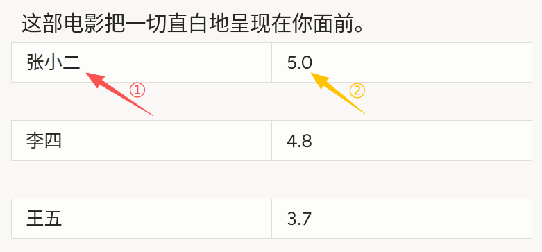
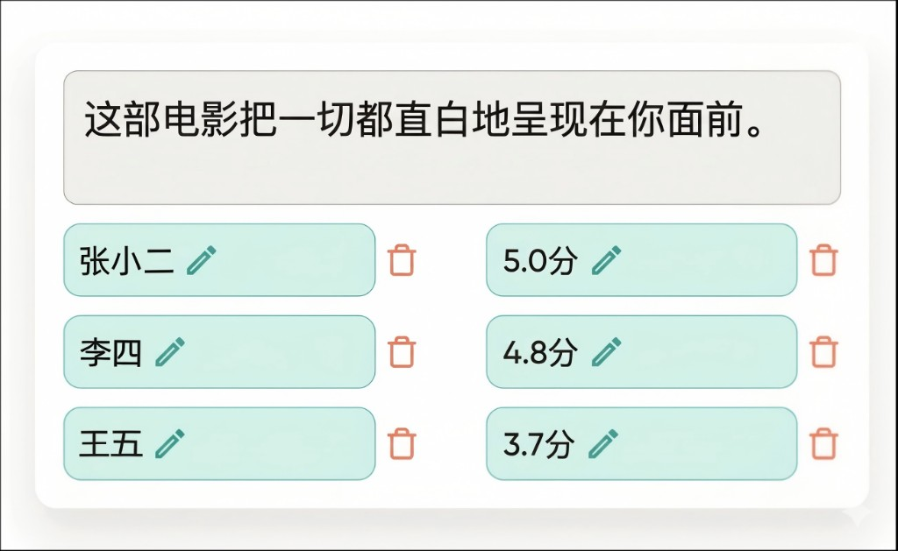

# 自由格式元数据使用说明

可以理解为「先读一段固定正文，再在下方表格里按行填写与正文相关的名称与取值」。例如影评场景中，从正文中归纳多位评论者及其评分，人工录入或修正「姓名—分数」对，便于构建**键值对齐原文**的监督数据。

## 标注核心作用

1.  `Text` 展示 `$text`，作为判断与填写的依据，通常不参与编辑；
2.  多组 `TextArea` 以 `grid` 排成两列，左列名称、右列值，结构清晰；
3.  `toName="text"` 将每个输入区与正文对象关联，导出时便于与同一任务对齐（具体以平台导出格式为准）。

## 基础操作步骤

1.  阅读顶部正文，明确需要抽取的实体或属性类型；
2.  在下方「名称」「值」成对输入框中填写或修改内容；可从正文复制或凭规范手写；
3.  若平台支持删除行，可通过行旁操作清理无效行后再提交；
4.  自检行数、格式与任务规范一致后提交。



说明：截图中①②示意首行「名称」与「值」输入区与影评人、分数的对应关系。

## 注意事项

- `editable="true"` 表示字段可编辑；`maxSubmissions="1"` 限制单字段提交条数，可按业务调整；
- `Style` 中针对 `input[name^="table"]` 等选择器用于微调边框与区域高度，**若类名或 `name` 前缀与平台实际 DOM 不一致可能不生效**，需按界面审查后修改；
- 样式块中的 `table_metric` 规则仅在存在对应 `name` 前缀的输入时有效，与当前 `table_name_*` / `table_value_*` 不一致时可删除或改写；
- 行数固定为三组时，空行导出策略以平台为准；若需动态增减行，需扩展配置或使用支持动态列表的组件。

## 模板预览



## 模板配置
### 完整代码块

```html
<View>
  <Style>
    input[type="text"][name^="table"] { border-radius: 0px; border-right: none;}
    input[type="text"][name^="table_metric"] { border-right: 1px solid #ddd; }
    div[class*=" TextAreaRegion_mark"] {background: none; height: 33px; border-radius: 0; min-width: 135px;}
  </Style>

  <Text value="$text" name="text"/>

  <View style="display: grid;  grid-template-columns: 1fr 1fr; max-height: 300px; width: 400px">
    <TextArea name="table_name_1" toName="text" placeholder="名称" editable="true" maxSubmissions="1"/>
    <TextArea name="table_value_1" toName="text" placeholder="值" editable="true" maxSubmissions="1"/>
    <TextArea name="table_name_2" toName="text" placeholder="名称" editable="true" maxSubmissions="1"/>
    <TextArea name="table_value_2" toName="text" placeholder="值" editable="true" maxSubmissions="1"/>
    <TextArea name="table_name_3" toName="text" placeholder="名称" editable="true" maxSubmissions="1"/>
    <TextArea name="table_value_3" toName="text" placeholder="值" editable="true" maxSubmissions="1"/>
  </View>
</View>
```

### 配置代码说明

以上代码为「样式覆盖 + 只读正文 + 两列网格中的多组文本域」。

1、样式：`Style` 内为平台渲染后的输入控件与区域类名编写 CSS，用于统一圆角、分隔线与最小宽度；需随版本在浏览器开发者工具中核对选择器是否仍匹配。

2、正文：`Text name="text" value="$text"` 从任务数据加载纯文本，作为上下文。

3、网格：`View` 使用 `display: grid` 与 `grid-template-columns: 1fr 1fr` 形成两列；`max-height`、`width` 可按布局调整。

4、字段：六个 `TextArea` 按行组成三对，`placeholder` 区分「名称」与「值」；`toName="text"` 绑定到上文 `Text` 对象。

### 示例数据（简要）

```json
{
  "data": {
    "text": "这部电影把一切直白地呈现在你面前。"
  }
}
```

说明

- 代码可直接复制到标注配置文件中使用；
- 预填键值若由导入任务提供，请在数据管道中写入与各 `TextArea` `name` 对应的预标注字段（以平台预标能力为准）。
