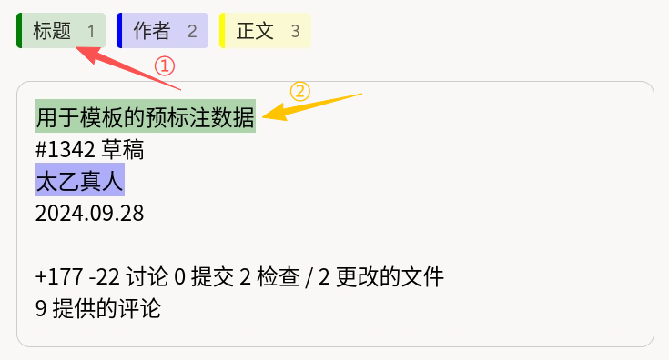
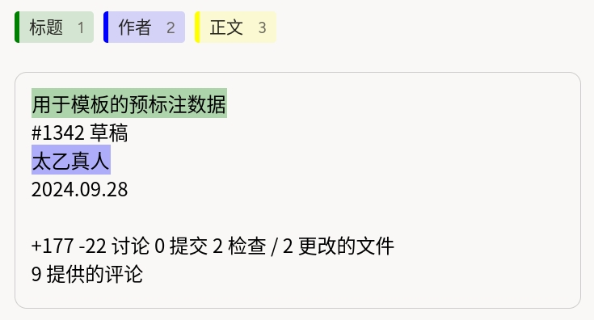

# HTML 实体识别使用说明

可以理解为「把一条样本里的 HTML 渲染成可读正文，再按项目定义的实体类型（如标题、作者、正文）框选或修正片段」。例如论坛帖、工单或文章页场景中，从已带 `header-tag`、`author-tag` 等类名的 DOM 结构出发，人工确认或补全实体边界，便于构建**网页级**序列标注与抽取评测数据。

## 标注核心作用

1.  `HyperText` 将 `$shtml` 中的 HTML 渲染为可交互文本层，支持在可见内容上直接划选；
2.  `HyperTextLabels` 提供多类实体标签及颜色，通常配合快捷键（如 1 / 2 / 3）加速标注；
3.  导出结果可与源 HTML 偏移或平台内部索引对齐，便于与预标注流水线、后处理脚本衔接。

## 基础操作步骤

1.  阅读任务说明，明确「标题」「作者」「正文」等业务含义与边界规则；
2.  在顶部选择实体类型的标签；
3.  在正文区域框选对应片段；若存在预上色或预框，仅做核对与修正。



说明：截图中①②示意标签栏与已标注片段的对应关系；绿色为「标题」、蓝色为「作者」，未着色部分可按规范补标「正文」等类型。

## 注意事项

- `data.shtml` 须为合法 HTML 字符串；特殊字符需按 JSON 正确转义；
- 类名（如 `header-tag`、`author-tag`、`content-block`）仅用于数据侧组织或预标注，**界面上的实体类型以 `HyperTextLabels` 的 `Label` 为准**；
- 复杂脚本、外链资源可能被平台安全策略过滤，宜使用静态、内联样式可控的片段做样本；
- 若需整段分类而非片段实体，请改用文档级 `Choices` 等模版。

## 模板预览



## 模板配置
### 完整代码块

```html
<View>
  <HyperTextLabels name="ner" toName="text">
    <Label value="标题" background="green"/>
    <Label value="作者" background="blue"/>
    <Label value="正文" background="yellow"/>
  </HyperTextLabels>

  <View style="border: 1px solid #CCC;
               border-radius: 10px;
               padding: 5px">
    <HyperText name="text" value="$shtml"/>
  </View>
</View>
```

### 配置代码说明

以上代码为「实体标签栏 + 带边框的正文区」，正文区渲染任务数据中的 HTML。

1、标签：`HyperTextLabels name="ner" toName="text"` 声明命名实体类型集合；每个 `Label` 的 `value` 为导出中的类型名，`background` 为标注高亮色。

2、绑定：`toName="text"` 与下方 `HyperText name="text"` 一致，表示这些标签作用于该文本对象。

3、正文：`HyperText name="text" value="$shtml"` 从任务数据的 `shtml` 字段加载 HTML 字符串并渲染；外层 `View` 的 `style` 仅控制容器边框与内边距，可按项目调整。

说明

- 代码可直接复制到标注配置文件中使用；
- 示例中首段对应「标题」、作者名为「作者」的常见布局，实际项目请替换为业务 HTML 并保持字段名与 `value="$shtml"` 一致。
