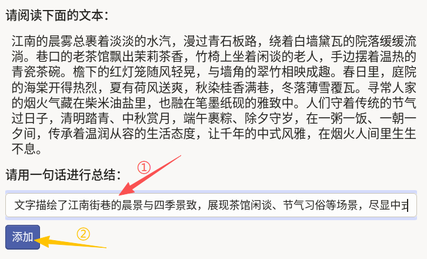
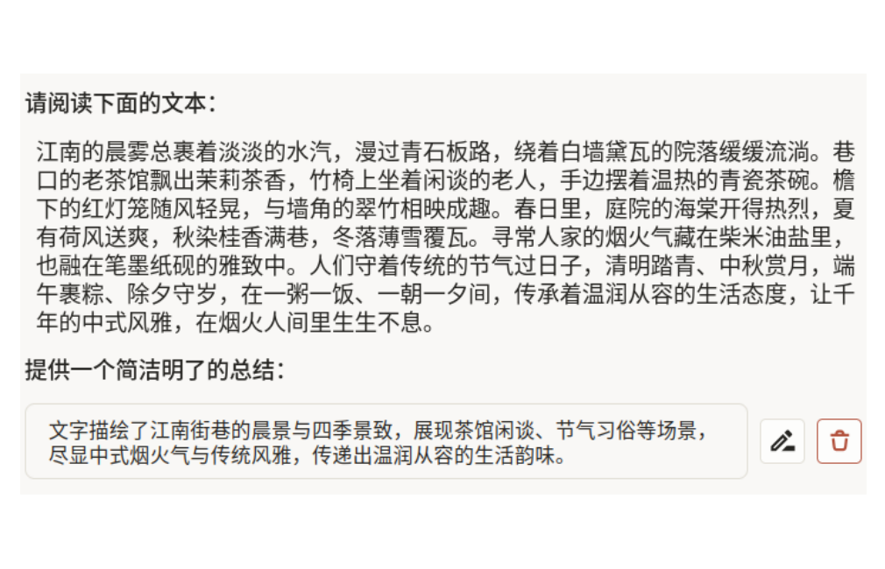

# 文本摘要使用说明

文本摘要可以理解为“读完原文，用一句话提炼核心信息”：标注员先阅读正文，再在输入框中写出简洁、准确、信息完整的一句话总结。该模板适用于资讯摘要、文档浓缩、内容分发与知识整理等场景。

## 标注核心作用

1.  构建高质量“原文-摘要”样本，用于摘要模型训练与评测；
2.  压缩冗余信息，保留关键事实，提升内容消费效率；
3.  统一摘要口径，便于后续质检与多版本对比。

## 基础操作步骤

1.  通读原文，识别主要对象、场景与核心观点；
2.  在“请用一句话进行总结”输入框中填写摘要，并检查摘要是否忠实原文、是否遗漏关键要点；
3.  点击添加按钮提交摘要。



说明：摘要建议控制在一句完整语义内，避免逐句拼接原文；优先“准确”再“精炼”。

## 注意事项

- `required="true"` 表示摘要必填，空值不可提交；
- `maxSubmissions="1"` 限制单条样本仅提交一条摘要；
- 避免加入原文未出现的事实或主观推断，确保信息保真。

## 模板预览



## 模板配置
### 完整代码块

```html
<View>
  <Header value="请阅读下面的文本：" />
  <Text name="text" value="$text" />

  <Header value="请用一句话进行总结：" />
  <TextArea name="answer" toName="text"
            showSubmitButton="true" maxSubmissions="1" editable="true"
            required="true" />
</View>
```

### 文本摘要配置代码说明

以上代码用于实现“阅读文本 -> 输出一句话摘要”的流程。

1、阅读区：`Text name="text" value="$text"` 用于展示待摘要文本。

2、摘要输入区：`TextArea name="answer" toName="text"` 绑定原文对象；`showSubmitButton="true"` 显示提交按钮；`maxSubmissions="1"` 限制单条提交一次；`required="true"` 要求必填。

### 示例数据（含标注结果）

```json
{
  "data": {
    "text": "江南的晨雾总裹着淡淡的水汽，漫过青石板路，绕着白墙黛瓦的院落缓缓流淌。巷口的老茶馆飘出茉莉茶香，竹椅上坐着闲谈的老人，手边摆着温热的青瓷茶碗。檐下的红灯笼随风轻晃，与墙角的翠竹相映成趣。春日里，庭院的海棠开得热烈，夏有荷风送爽，秋染桂香满巷，冬落薄雪覆瓦。寻常人家的烟火气藏在柴米油盐里，也融在笔墨纸砚的雅致中。人们守着传统的节气过日子，清明踏青、中秋赏月，端午裹粽、除夕守岁，在一粥一饭、一朝一夕间，传承着温润从容的生活态度，让千年的中式风雅，在烟火人间里生生不息。"
  },
  "annotations": [
    {
      "result": [
        {
          "value": {
            "text": [
              "文字描绘了江南街巷的晨景与四季景致，展现茶馆闲谈、节气习俗等场景，尽显中式烟火气与传统风雅，传递出温润从容的生活韵味。"
            ]
          },
          "id": "Zc_Rb6Bszp",
          "from_name": "answer",
          "to_name": "text",
          "type": "textarea"
        }
      ]
    }
  ]
}
```

说明
- 代码可直接复制到标注配置文件中使用；
- 可按业务将“句数限制”写入标注规范（如严格一句、最多两句）；
- 若需多版本摘要对比，可通过多人标注或复核流程实现。
