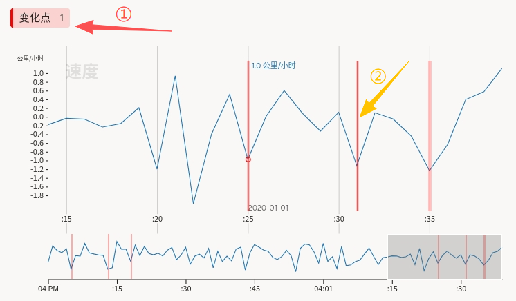
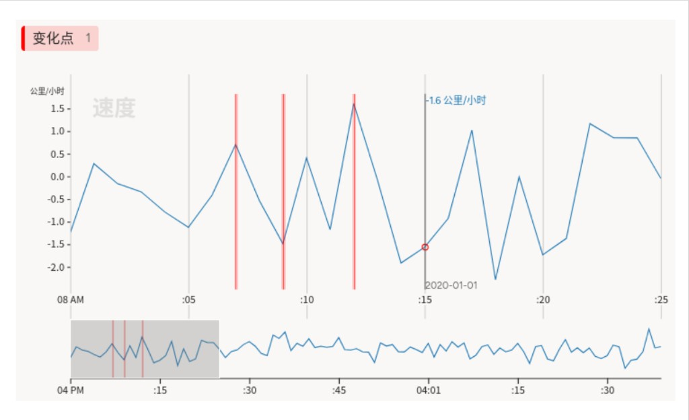

# 变化点监测使用说明

可以理解为「在一条随时间变化的曲线（如速度）上，标出你认为**性质发生明显变化**的时刻」。例如运动学或过程监控场景中，在峰值、谷值或斜率突变处打点，便于构建**变点检测**或分段模型的训练与评测数据。

## 标注核心作用

1.  单通道 `TimeSeries` 配置简单，适合只关心一条主序列时的标注与质检；
2.  `TimeSeriesLabels` 仅一类「变化点」时，界面聚焦单一操作，减少歧义；
3.  `overviewChannels` 在底部展示全序列缩略图，已标变化点可在概览中一览位置。

## 基础操作步骤

1.  阅读任务说明，明确「变化点」的判定标准；
2.  选中 **变化点** 标签（或对应快捷键，以平台为准）；
3.  找到主图时间轴上需要标记的位置，双击即可进行标注。



说明：底部细条为全序列概览，灰框表示当前放大区间。

## 注意事项

- 任务数据字段名为 `csv`，与配置中 `value="$csv"` 一致；须为可访问的 CSV URL；
- CSV 须含 `time` 与 `velocity`（或与 `Channel column` 一致的列名），分隔符与 `timeFormat` 须与文件一致；
- 若平台将此类标签实现为**极短区间**而非单点，导出时请以平台结果结构为准，并在评测脚本中统一为「时刻」或「区间」；
- 与**活动识别**等多类区间标注相比，本模版仅一种标签，更适合纯变点或统一叫法的项目。

## 模板预览



## 模板配置
### 完整代码块

```html
<View>
    <!-- 控制标签：区域标注 -->
    <TimeSeriesLabels name="label" toName="ts">
        <Label value="变化点" background="red" />
    </TimeSeriesLabels>

    <!-- 对象标签：时间序列数据源 -->
    <TimeSeries name="ts" valueType="url" value="$csv"
                sep=","
                timeColumn="time"
                timeFormat="%Y-%m-%d %H:%M:%S.%L"
                timeDisplayFormat="%Y-%m-%d"
                overviewChannels="velocity">

        <Channel column="velocity"
                 units="公里/小时"
                 displayFormat=",.1f"
                 strokeColor="#1f77b4"
                 legend="速度"/>
    </TimeSeries>
</View>
```

### 配置代码说明

以上代码为「单一变化点标签 + 单通道速度曲线 + 底部概览」。

1、标签：`TimeSeriesLabels name="label" toName="ts"` 声明可标注类型；此处仅 `变化点` 一种，`background` 控制标记颜色。

2、数据：`TimeSeries name="ts" value="$csv"` 从任务数据的 **`csv` 字段**加载 CSV；`overviewChannels="velocity"` 指定底部缩略图使用的列名。

3、通道：`Channel` 的 `column="velocity"` 对应 CSV 列；`units`、`legend`、`strokeColor`、`displayFormat` 控制纵轴单位、图例、曲线颜色与数值格式。

### 示例数据（简要）

```json
{
  "data": {
    "csv": "/static/templates/project-templates-config/time-series-analysis/change-point-detection/timeseries.csv"
  }
}
```

说明

- 代码可直接复制到标注配置文件中使用；
- 请将示例 URL 替换为实际上传或可访问的静态资源地址，并保证列名、时间格式与配置一致。
