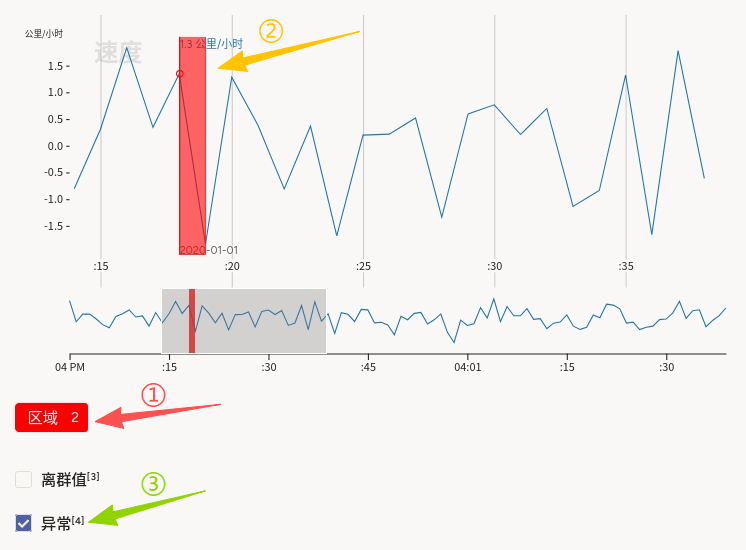
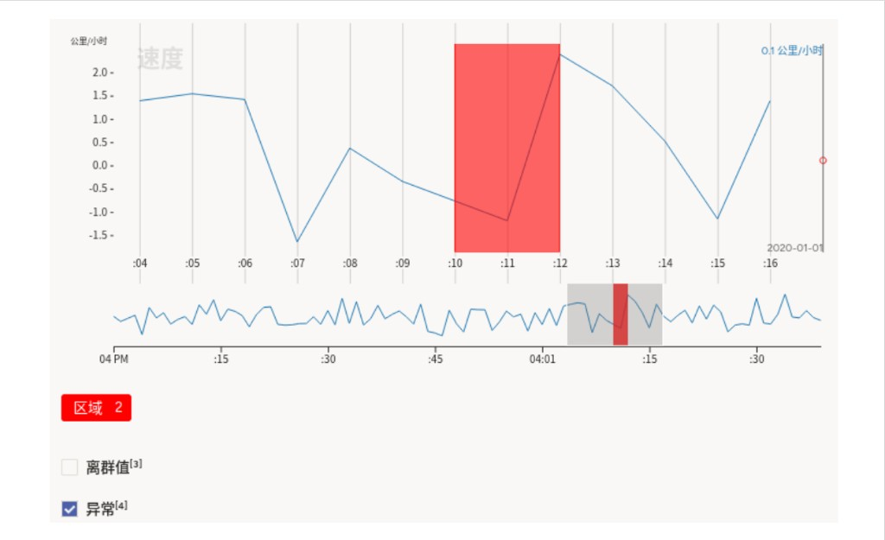

# 异常值和异常检测使用说明

可以理解为「先在曲线上圈出一段可疑区间，并选择异常类型」。例如传感器质检场景中，对速度曲线上的尖峰或平台期划区，并勾选「异常」，便于构建**区段 + 属性**的监督或弱监督数据。

## 标注核心作用

1.  `TimeSeries` 提供与**变化点监测**相同的单通道浏览与底部概览体验；
2.  `TimeSeriesLabels` 用「区域」类标签支持**时间轴上的区间**标注；
3.  `Choices` 配合 `perRegion="true"`，使「离群值 / 异常」等选项**随当前选中区域切换**，实现「一段一判」。

## 基础操作步骤

1.  阅读任务说明，明确「离群值」与「异常」的定义及是否允许多选、是否互斥；
2.  选择 **区域** 标签，在主图上拖选需要标注的时间范围；
3.  选中该区间后，在下方选项中勾选 **离群值**、**异常** 等（`required="true"` 时须满足必选规则后再提交）。



说明：重复上述步骤可对其它可疑区间进行标注，必要时用底部概览跳转视窗。

## 注意事项

- 任务数据仍使用 **`csv` 字段**与 `value="$csv"` 对应；CSV 列须含 `time`、`velocity`（或与 `Channel` 一致）；
- `perRegion="true"` 表示选项绑定到**每个已标区域**；切换选中区域时，选项面板会随当前区域变化；
- `required="true"` 表示提交前需完成与选项相关的必填校验；若业务允许「仅划区不分类」，需与产品确认是否放宽 `required`；
- 「离群值」与「异常」的语义边界应在培训材料中写清，避免标注员理解不一致。

## 模板预览



## 模板配置
### 完整代码块

```html
<View>
    <!-- 对象标签：时间序列数据源 -->
    <TimeSeries name="ts" valueType="url" value="$csv"
                sep=","
                timeColumn="time"
                timeFormat="%Y-%m-%d %H:%M:%S.%L"
                timeDisplayFormat="%Y-%m-%d"
                overviewChannels="velocity">

        <Channel column="velocity"
                 units="公里/小时"
                 displayFormat=",.1f"
                 strokeColor="#1f77b4"
                 legend="速度"/>
    </TimeSeries>

    <!-- 控制标签：区域标注 -->
    <TimeSeriesLabels name="label" toName="ts">
        <Label value="区域" background="red" />
    </TimeSeriesLabels>

    <Choices name="region_type" toName="ts"
          perRegion="true" required="true">
        <Choice value="离群值"/>
        <Choice value="异常"/>
    </Choices>
</View>
```

### 配置代码说明

以上代码为「时间序列 + 区域标签 + 按区域生效的分类选项」。

1、数据：`TimeSeries` 与单通道示例一致，从 `$csv` 加载；`overviewChannels="velocity"` 驱动底部概览。

2、区段：`TimeSeriesLabels` 中 `Label value="区域"` 表示在时间轴上创建的可编辑区间类型；`toName="ts"` 绑定到同一时间序列对象。

3、选项：`Choices name="region_type" toName="ts"` 与序列绑定；`perRegion="true"` 表示每个「区域」实例可单独勾选「离群值」「异常」；`required="true"` 控制提交前是否必须完成选项。

### 示例数据（简要）

```json
{
  "data": {
    "csv": "/static/templates/project-templates-config/time-series-analysis/outliers-anomaly-detection/timeseries.csv"
  }
}
```

说明

- 代码可直接复制到标注配置文件中使用；
- 请将示例 URL 替换为实际上传或可访问的静态资源地址，并保证列名、时间格式与配置一致。
