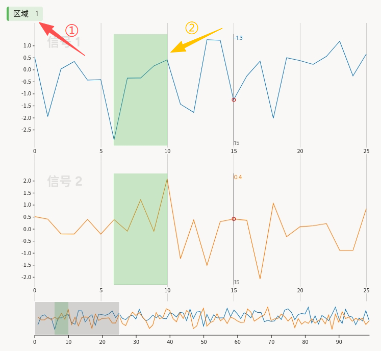
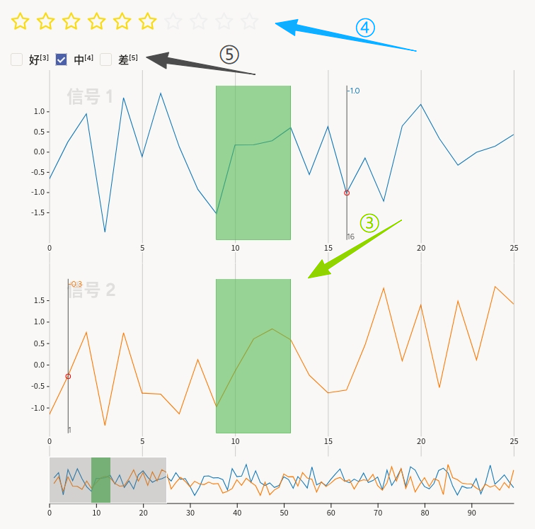
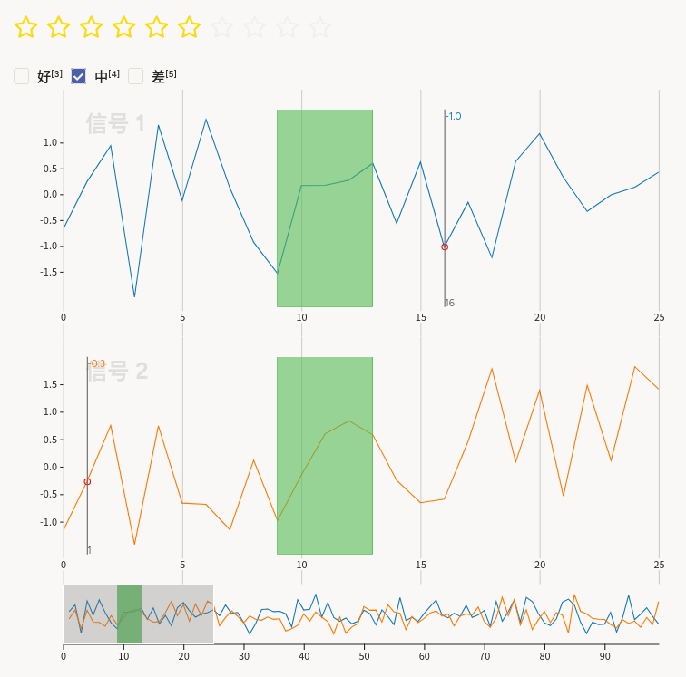

# 信号质量使用说明

可以理解为「在两条同步曲线上圈出一段信号，再对这段打星并进行质量评判」。例如传感器质检场景中，对某段时间窗口内的波形做主观打分，便于构建**区段 + 序数/分类**的混合标注数据。

## 标注核心作用

1.  `visibleWhen="no-region-selected"` 仅在未选中区域时显示 **TimeSeriesLabels**，引导用户先创建「区域」；
2.  `visibleWhen="region-selected"` 在选中区域后显示 **Rating** 与 **Choices**，避免空白时误触评分；
3.  `Rating`、`Choices` 均设 `perRegion="true"`，与**异常值和异常检测**类似，实现「一段一星一档」。

## 基础操作步骤

1.  阅读任务说明，明确「好 / 中 / 差」与星级分档的对应关系；
2.  在未选区状态下选择 **区域**标签；
3.  在主图时间轴上拖选要评估的区间（双通道上会同步高亮）；
4.  单击任意高亮区域，在上方出现的控件中拖动 **星级**；
5.  并单选 **好 / 中 / 差**（`required="true"` 时须完成必选项）。




说明：可切换其它区域重复评分，必要时用底部概览移动视窗。

## 注意事项

- 任务数据使用 **`csv`** 与 `value="$csv"`；CSV 须包含 `time`、`signal_1`、`signal_2` 等列，分隔符与平台解析规则需一致；若时间列为非默认格式，可在 `TimeSeries` 上补充 `timeFormat` / `timeDisplayFormat` / `overviewChannels` 等属性（以平台文档为准）；
- `Choices` 为 `showInline="true"` 时选项横向排列；改为竖排可去掉或调整该属性；
- 星级与档位语义应在培训材料中统一，避免同一分数对应不同理解；
- 若需无区域时的全局评分，需另增不依赖 `perRegion` 的控件，与本模版交互不同。

## 模板预览




## 模板配置
### 完整代码块

```html
<View>
    <!-- 未选中区域时的区块 -->
    <View visibleWhen="no-region-selected"
          style="height:30px">

        <!-- 控制标签：区域标注 -->
        <TimeSeriesLabels name="label" toName="ts">
            <Label value="区域" background="#5b5"/>
        </TimeSeriesLabels>
    </View>

    <!-- 选中区域后的区块：选项与评分 -->
    <View visibleWhen="region-selected" style="height:80px">

        <!-- 按区域评分 -->
        <Rating name="rating" toName="ts"
                maxRating="10" icon="star"
                perRegion="true"/>
        <!-- 按区域单选 -->
        <Choices name="choices" toName="ts"
                 showInline="true" required="true"
                 perRegion="true">
            <Choice value="好"/>
            <Choice value="中"/>
            <Choice value="差"/>
        </Choices>
    </View>

    <!-- 对象标签：时间序列数据源 -->
    <TimeSeries name="ts" valueType="url" value="$csv"
                sep="," timeColumn="time">
        <Channel column="signal_1"
                 strokeColor="#17b" legend="信号 1"/>
        <Channel column="signal_2"
                 strokeColor="#f70" legend="信号 2"/>
    </TimeSeries>
</View>
```

### 配置代码说明

以上代码为「条件显隐的工具栏 + 双通道时间序列 + 按区段评分与分类」。

1、显隐：外层 `View visibleWhen="no-region-selected"` 仅容纳 `TimeSeriesLabels`；`visibleWhen="region-selected"` 容纳 `Rating` 与 `Choices`。二者高度由 `style="height:…"` 预留，可按布局微调。

2、区域：`TimeSeriesLabels` 的 `Label value="区域"` 定义可编辑区间；`toName="ts"` 绑定时间序列对象。

3、评分：`Rating name="rating" toName="ts" perRegion="true"` 表示每个区域独立存储星级；`maxRating="10"`、`icon="star"` 为十分制星标。

4、档位：`Choices` 使用 `perRegion="true"` 与 `required="true"`，`showInline="true"` 横向展示「好 / 中 / 差」；单选行为以平台 `Choices` 默认为准。

5、数据：`TimeSeries` 从 `$csv` 加载；两条 `Channel` 分别对应 `signal_1`、`signal_2` 列及曲线颜色、图例。

### 示例数据（简要）

```json
{
  "data": {
    "csv": "/static/templates/project-templates-config/time-series-analysis/signal-quality/timeseries.csv"
  }
}
```

说明

- 代码可直接复制到标注配置文件中使用；
- 请将示例 URL 替换为实际上传或可访问的静态资源地址；CSV 列名须与 `timeColumn`、`Channel column` 一致。
