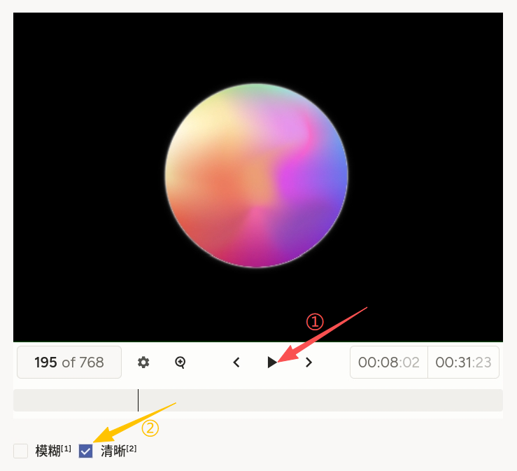
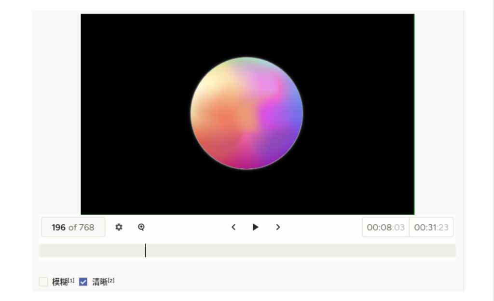

# 视频分类使用说明

可以理解为「对视频画面进行简单的分类」。例如对画面整体做「模糊 / 清晰」判断时，可在关键时段拖动时间轴确认后再勾选。它适合视频画质评估、粗粒度内容分类与快速筛选类任务。

## 标注核心作用

1.  `Video` 与时间轴高度可配，便于对齐播放进度与标注时刻；
2.  `Choices` 绑定到 `video` 对象，导出时标签与视频字段一一对应；
3.  布局紧凑，适合批量浏览短视频或片段。

## 基础操作步骤

1.  使用播放、暂停与进度条浏览视频，必要时逐段确认；
2.  在「模糊」「清晰」等选项中选择一项（单选行为以 `Choices` 配置为准）；
3.  确认选项与项目定义一致后提交。




## 注意事项

- `data.video` 须为可访问的视频 URL 或平台支持的相对路径；
- `height`、`timelineHeight` 可按分辨率与操作习惯调整；
- 若需多标签，可将 `choice` 改为多选模式（以平台属性为准）并更新质检规则；
- 注释中的 `annotations` 为**导出/回显**结构示例；新建任务导入时通常只需 `data` 部分。

## 模板预览



## 模板配置
### 完整代码块

```html
<View style="padding: 0; margin: 0;">
  <Video name="video" value="$video" height="360" timelineHeight="80" style="display: block; margin: 0; padding: 0;" />
  <Choices name="choice" toName="video" showInline="true">
    <Choice value="模糊" />
    <Choice value="清晰" />
  </Choices>
</View>
```

### 配置代码说明

以上代码实现「视频播放 + 底部分类选项」。

1、视频：`Video name="video" value="$video"` 加载任务数据中的视频字段；`height` 控制播放器区域高度，`timelineHeight` 控制时间轴区域高度。

2、分类：`Choices name="choice" toName="video"` 将选项与视频对象绑定；`showInline="true"` 为横向排列（若环境使用 `showInLine` 拼写，请与平台文档一致）。

3、选项：`Choice` 的 `value` 即导出中的类别文案，可按业务替换。

### 示例数据（简要）

**导入任务（仅需 `data`）**

```json
{
  "data": {
    "video": "/static/templates/project-samples/video-classification.mp4"
  }
}
```

**导出结果结构示例（节选，字段以实际平台为准）**

```json
{
  "data": {
    "video": "/static/templates/project-samples/video-classification.mp4"
  },
  "annotations": [
    {
      "result": [
        {
          "value": {
            "choices": ["模糊"]
          },
          "id": "vB3U85jSU4",
          "from_name": "choice",
          "to_name": "video",
          "type": "choices"
        }
      ]
    }
  ]
}
```

说明
- 代码可直接复制到标注配置文件中使用；
- 替换 `Choice` 或增加类别时，请同步培训材料与质检规则；
- 长视频建议约定「以全片为准」或「以当前暂停帧/片段为准」等统一标准。