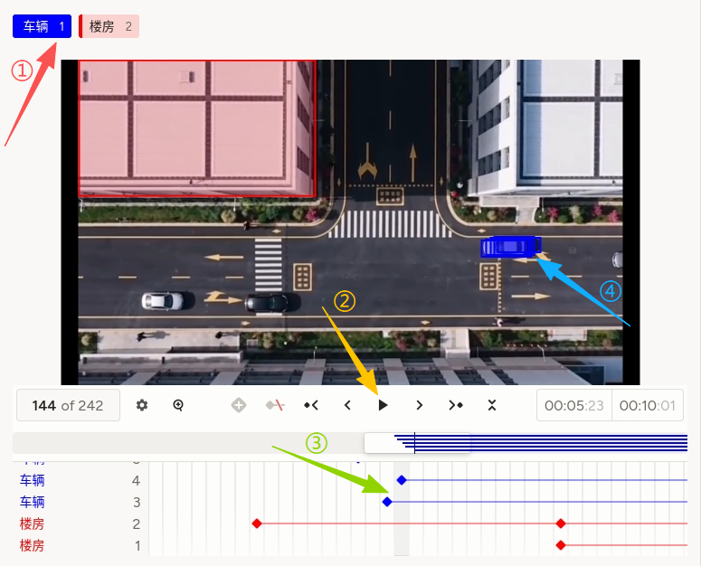
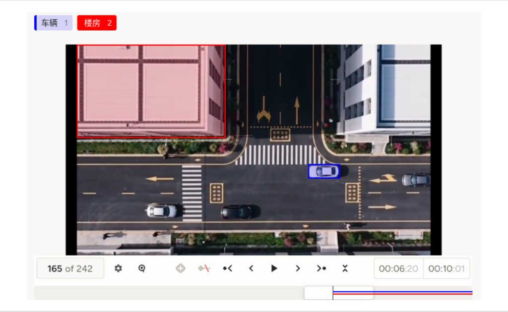

# 视频对象跟踪使用说明

可以理解为「先选类别，再在画面上拖出矩形框，并在时间轴上为每个目标打关键帧或调整轨迹」。与仅做时间轴类别标记的「视频帧分类」不同，本模版输出的是**随时间变化的框位置**。它适合交通监控、无人机视角、体育转播等需要多目标轨迹的数据集。

## 标注核心作用

1.  `Labels` 定义类别颜色，`VideoRectangle` 在同一视频上绘制多实例框；
2.  时间轴可展示每条轨迹与关键帧，便于检查漏标与 ID 切换；
3.  `allowEmpty="false"` 要求至少选择标签后再标注（以平台行为为准）。

## 基础操作步骤

1.  点选标签（如「车辆」「楼房」），在画面上绘制或调整矩形框；
2.  播放或逐帧前进，在目标形变或遮挡处补充关键帧；
3.  在时间轴上核对各实例轨道是否连续、ID 是否串扰；
4.  完成后提交。



说明：截图中①—④示意选标签、播放、时间轴关键帧与画面框；以实际产品为准。

## 注意事项

- 导入任务使用 **`data.video`**；注释中裸 `video` 字段需包在 `data` 内；
- **帧率（FPS）** 通常在项目或视频导入层统一配置，错误帧率会导致时间戳与轨迹与真实时间不对齐，请与工程侧确认；
- `height`、`timelineHeight` 可按分辨率调整；长视频注意性能与抽检策略；
- 多目标时需约定 ID 规则、遮挡与出画处理、最小框面积等质检条款。

## 模板预览



## 模板配置
### 完整代码块

```html
<View style="padding: 0; margin: 0;">
  <Labels name="videoLabels" toName="video" allowEmpty="false">
    <Label value="车辆" background="blue"/>
    <Label value="楼房" background="red"/>
  </Labels>

  <!-- 请谨慎设置 FPS（帧率），该值会应用于当前项目的所有视频 -->
  <Video name="video" value="$video" height="360" timelineHeight="80" style="display: block; margin: 0; padding: 0;" />
  <VideoRectangle name="box" toName="video" />
</View>
```

### 配置代码说明

以上代码为「类别标签 + 视频播放 + 矩形框跟踪」组合。

1、标签：`Labels name="videoLabels" toName="video"` 将「车辆」「楼房」等类别绑定到视频；`allowEmpty="false"` 表示需先选类再画框（具体校验以平台为准）。

2、视频：`Video` 加载 `$video`；注释提醒 FPS 影响全项目视频时间基准。

3、画框：`VideoRectangle name="box" toName="video"` 在视频画面上绘制、编辑随时间变化的矩形区域。

### 示例数据（简要）

示例路径中的 `?v=20260415` 等为可选查询参数，多在路径不变时用来刷新浏览器或 CDN 缓存；换版样例时改掉日期或版本号即可，并非 mp4 格式要求。

```json
{
  "data": {
    "video": "/static/templates/project-samples/video-object-tracking.mp4?v=20260415"
  }
}
```

说明
- 代码可直接复制到标注配置文件中使用；
- 增删 `Label` 时请同步更新数据规范与评测脚本中的类别映射；
- 若需多边形或其它形状跟踪，请改用平台支持的对应对象组件。