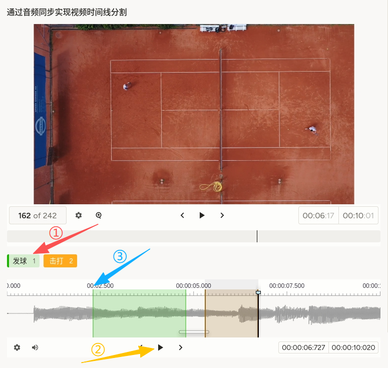
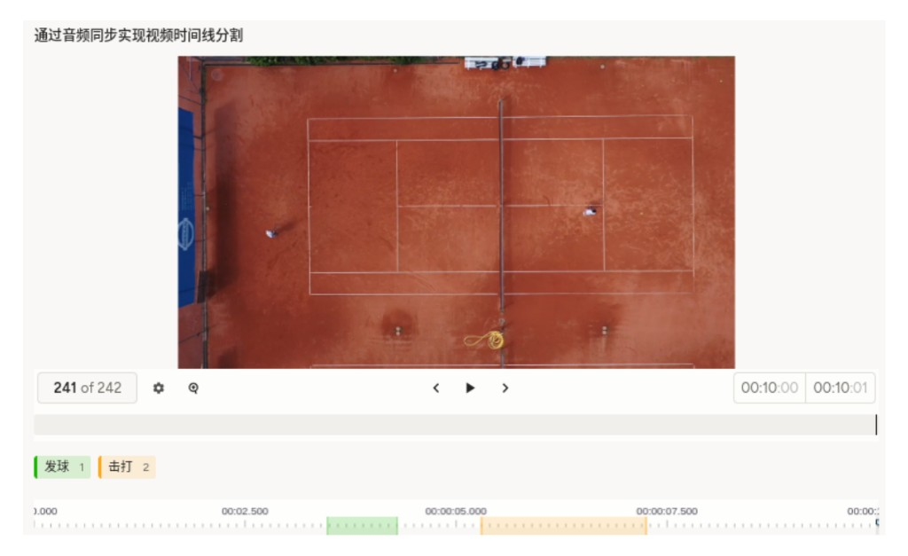

# 视频时间线分割使用说明

可以理解为「看视频、对音轨时间线打彩色区段，标出不同事件的时间线」。`Video` 与 `Audio` 互相 `sync`，拖动一边另一边对齐，便于按声音起落或画面动作对齐切片。它适合网球/羽毛球等击球事件、音乐节拍、口令起止等**时间轴级**标注。

## 标注核心作用

1.  音画同步减少「只看视频猜声音」带来的边界误差；
2.  `Labels` 绑定在 `audio` 上，区段直接落在可缩放波形时间轴；
3.  `choice="multiple"` 允许同一时段多标签策略（以项目规范为准）。

## 基础操作步骤

1.  阅读标题说明，明确要求，并初步观看视频，了解视频内容；
2.  播放或拖动时间轴，结合画面与波形确定事件起止；
3.  选择「发球」「击打」等标签，在音频轨道上创建并调整区段；
4.  复核同步与边界后提交。



说明：此模板音画同频，而且可调节音量大小和速度，可以精准的进行时间线的分割。

## 注意事项

- 任务数据须包含 **`data.video`** 与 **`data.audio`**（见示例）；二者时长与起点应对齐，否则 sync 会产生漂移；
- 常见做法是**静音或低音量视频 + 独立音轨**（如 mp3）以保证波形质量；是否共用同一媒体文件取决于平台能力与项目配置；
- `speed="false"` 关闭变速播放时的时间扭曲（以平台解释为准）；
- 事件定义、是否允许重叠区段、最短片段长度等需在标注规范中写明。

## 模板预览



## 模板配置
### 完整代码块

```html
<View style="padding: 0; margin: 0;">
  <Header value="通过音频同步实现视频时间线分割"/>
  <Video name="video" value="$video" height="360" timelineHeight="80" style="display: block; margin: 0; padding: 0;" sync="audio"/>
  <Labels name="tricks" toName="audio" choice="multiple">
    <Label value="发球" background="#1BB500"/>
    <Label value="击打" background="#FFA91D"/>
  </Labels>
  <Audio name="audio" value="$audio" sync="video" speed="false"/>
</View>
```

### 配置代码说明

以上代码实现「标题 + 同步视频 + 音轨标签 + 波形区段」。

1、视频：`Video` 设置 `sync="audio"`，播放进度与下方音轨对齐。

2、标签：`Labels name="tricks" toName="audio" choice="multiple"` 将可选事件绑定到音频对象，支持多选语义（具体交互以平台为准）。

3、音频：`Audio name="audio" value="$audio" sync="video"` 与视频互锁；`speed="false"` 控制是否允许变速相关选项。

### 示例数据（简要）

示例路径中的 `?v=20260415` 等为可选查询参数，多在路径不变时用来刷新浏览器或 CDN 缓存；音视频样例换版时同步修改即可，并非 mp4/mp3 格式要求。

以下与注释中的路径一致；导入时请置于 `data` 下。

```json
{
  "data": {
    "video": "/static/templates/project-samples/video-timeline-segmentation.mp4?v=20260415",
    "audio": "/static/templates/project-samples/video-timeline-segmentation.mp3?v=20260415"
  }
}
```

说明
- 代码可直接复制到标注配置文件中使用；
- 增删 `Label` 时请同步更新事件定义与评测脚本；
- 若仅需单选区段，可将 `choice` 改为 `single` 或按平台文档调整。