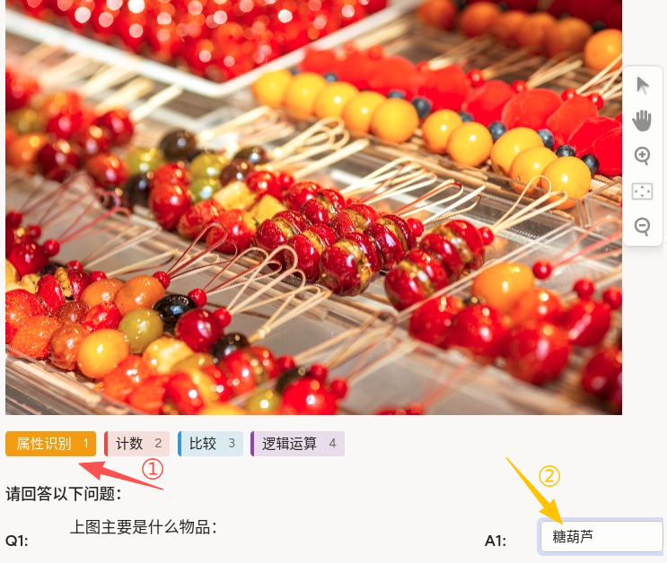
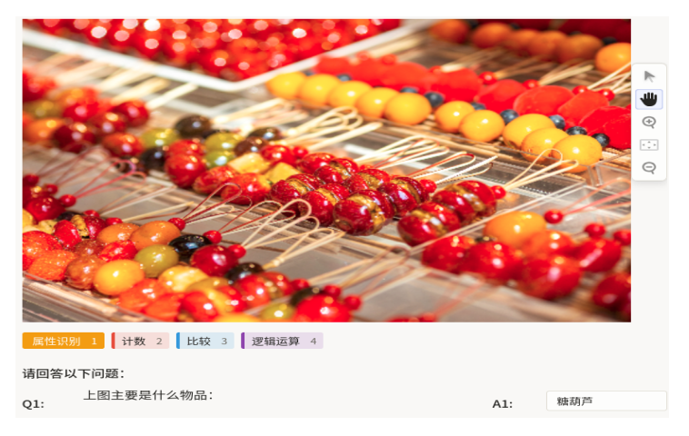

# 视觉问答使用说明

视觉问答可以理解为“先看图，再回答问题”：根据给定图片内容，逐条回答问题文本（Q1/Q2/Q3），并录入对应答案。它适合属性识别、计数、比较、逻辑推理等任务，常用于多模态理解与推理模型训练场景。

## 标注核心作用

1.  构建图文推理数据：将图像与问题、答案配对，形成标准化问答样本；
2.  支持多类型问题标签：可按“属性识别/计数/比较/逻辑运算”区分任务类型；
3.  适配批量问答流程：同一图像可配置多问题输入，提高标注效率。

## 基础操作步骤

1.  查看图片并选择问题类型标签；
2.  阅读 Q1~Q3 问题内容并逐项作答；
3.  检查答案准确性后提交。



说明：建议先完整阅读全部问题，再统一作答，减少前后答案不一致。

## 注意事项

- 答案应基于图像可见信息，不添加主观推测；
- 计数类问题需统一计数口径（如是否包含遮挡目标）；
- 比较和逻辑题建议先明确对象，再给出简洁结论。

## 模板预览



## 模板配置
### 完整代码块

```html
<View>
  <Image name="image" value="$image_path"/>
  <Labels name="aspect" toName="q1">
    <Label value="属性识别" background="#F39C12"/>
    <Label value="计数" background="#E74C3C"/>
    <Label value="比较" background="#3498DB"/>
    <Label value="逻辑运算" background="#8E44AD"/>
  </Labels>
  <Header value="请回答以下问题："/>

  <View style="display: grid; grid-template-columns: 1fr 10fr 1fr 3fr; column-gap: 1em">
    <Header value="Q1:"/>
    <Text name="q1" value="$q1"/>
    <Header value="A1:"/>
    <TextArea name="answer1" toName="q1" rows="1" maxSubmissions="1"/>
  </View>

  <View style="display: grid; grid-template-columns: 1fr 10fr 1fr 3fr; column-gap: 1em">
    <Header value="Q2:"/>
    <Text name="q2" value="$q2"/>
    <Header value="A2:"/>
    <TextArea name="answer2" toName="q2" rows="1" maxSubmissions="1"/>
  </View>
  <View style="display: grid; grid-template-columns: 1fr 10fr 1fr 3fr; column-gap: 1em">
    <Header value="Q3:"/>
    <Text name="q3" value="$q3"/>
    <Header value="A3:"/>
    <TextArea name="answer3" toName="q3" rows="1" maxSubmissions="1"/>
  </View>
</View>
```

### 视觉问答配置代码说明

以上代码用于实现“图像 + 多问题 + 多答案输入”的 VQA 标注流程。

1、问题类型标签：`Labels name="aspect"` 用于标记当前问答任务类型（如属性识别、计数等）。

2、问题与答案区域：每个问题采用 `Text` 展示问题内容，`TextArea` 接收答案输入，`maxSubmissions="1"` 限制单题单答案提交。

3、布局方式：通过 `grid` 排列 Q/A 字段，提升多问题场景下的可读性。

### 示例数据（简要）

以下示例展示如何向模板传入图像地址与问题文本，可按项目实际问题内容替换。

```json
{
  "data": {
    "image_path": "/static/templates/project-templates-config/computer-vision/visual-question-answering/visual-question-answering.png",
    "q1": "上图主要是什么物品：",
    "q2": "问题2",
    "q3": "问题3"
  }
}
```

说明
- 代码可直接复制到标注配置文件中使用；
- 问题数量可按需求扩展，保持 `Text` 与 `TextArea` 成对出现即可；
- 建议制定答案格式规范（如单位、数字格式）以便后续训练与评估。
